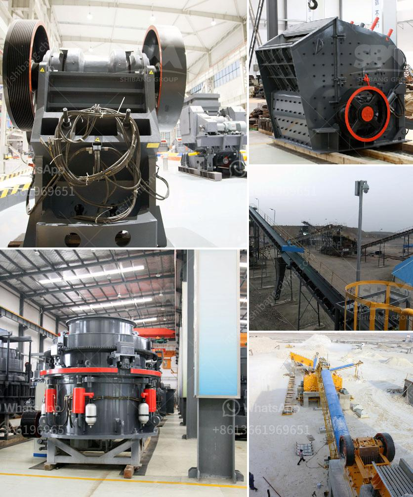

<h3>crusher how to calculate the cost of returns</h3>
Returns are an inevitable aspect of crusher operations in industries such as mining, construction, and recycling. Calculating the cost of returns is crucial for businesses to make informed decisions, optimize efficiency, and ensure profitability. In this article, we will explore the key factors involved in calculating the cost of returns in crusher operations.

To accurately determine the cost of returns, it is essential to quantify the volume of returned materials. This can be achieved through systematic tracking, documentation, and analysis of returned products or materials. By recording the quantity of returned materials, businesses can assess the scale of returns they are dealing with.

Determining the reasons behind returns is equally vital. It can include factors such as defective or damaged products, incorrect specifications or measurements, ineffective communication with customers, or unsatisfactory performance. By identifying these reasons, businesses can take corrective measures to reduce returns and optimize efficiency.

Calculating the costs associated with each return requires the evaluation of various factors. Direct costs may involve labor, transportation, packaging, and the disposal of returned materials. Indirect costs may comprise lost productivity, customer dissatisfaction, potential impact on future sales, and damage to brand reputation. Assigning monetary values to these costs will enable businesses to understand the true impact of returns on their operations.

Alongside direct and indirect costs, it is crucial to consider administrative costs associated with processing returns. These costs involve the manpower and resources dedicated to handling paperwork, verification, and refurbishment (if applicable). Accurately quantifying these administrative costs will help in calculating the overall cost of returns.

Once the cost of returns is assessed, businesses can identify areas for improvement to reduce returns and their associated costs. This might include investing in quality control mechanisms, enhancing communication strategies, improving product designs, and addressing customer concerns. Implementing preventive measures can lead to significant cost-savings in the long run.

Calculating the cost of returns in crusher operations enables businesses to make informed decisions regarding process optimization, product quality, and customer satisfaction. By quantifying the volume of returns, identifying reasons, assessing direct and indirect costs, factoring in administrative expenses, and incorporating preventive measures, companies can aim to minimize returns and maximize profitability. Understanding and managing the cost of returns is an essential part of running a successful crusher operation.
<h3>Contact us</h3><ul><li><strong>Whatsapp:&nbsp;<a href="https://wa.me/8613661969651">+8613661969651</a></strong></li><li><a href="https://swt.shibang-china.com/?git&amp;zhl&amp;crusher how to calculate the cost of returns"><strong>Online Service(chat now)</strong></a></li></ul><h3>Related</h3><ul><li><a href='south africa used chrome ore mining crushing equipment.md'>south africa used chrome ore mining crushing equipment</a></li><li><a href='components cone crusher and hydraulic system.md'>components cone crusher and hydraulic system</a></li><li><a href='graphite processing and beneficiation.md'>graphite processing and beneficiation</a></li><li><a href='copper processing plants in usa for sale.md'>copper processing plants in usa for sale</a></li><li><a href='cost of setting up cement plant in south africa.md'>cost of setting up cement plant in south africa</a></li></ul>