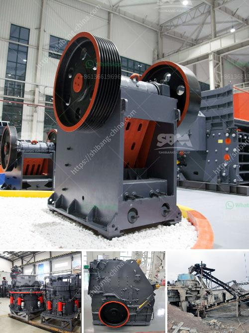

<h3>crusher machine company in spain</h3>
When it comes to the manufacturing of heavy-duty machinery, Spain has emerged as a global leader. One such company that has been making waves in the industry is Crusher Machine Company. With their headquarters located in Madrid, this company has become a trusted name among customers searching for high-quality crushing machines.

The crusher machines manufactured by this Spanish company have gained immense popularity due to their durability, efficiency, and cutting-edge technology. Whether it's for mining, construction, or recycling applications, these machines are designed to handle various materials with ease. From hard and abrasive minerals to fragile and delicate materials, Crusher Machine Company's products can crush it all.

What sets Crusher Machine Company apart from its competitors is its relentless pursuit of innovation. The company invests heavily in research and development to constantly improve its products and stay ahead of the curve. With a team of highly skilled engineers and technicians, Crusher Machine Company continues to develop new features and technologies that enhance the performance and reliability of their machines.

Customer satisfaction is also a top priority for Crusher Machine Company. They strive to provide excellent customer support throughout the entire buying and after-sales process. Whether it's technical assistance, spare parts, or maintenance services, the company offers comprehensive solutions to ensure that their customers' machines operate seamlessly.

Crusher Machine Company's commitment to sustainability is worth mentioning as well. They actively incorporate eco-friendly practices into their manufacturing processes, reducing their carbon footprint and contributing to a cleaner environment. This dedication to sustainability has helped the company establish a positive reputation within the industry and among conscious customers.

In conclusion, Crusher Machine Company in Spain is undoubtedly a leading player in the heavy machinery manufacturing sector. With their state-of-the-art technology, commitment to innovation, and focus on customer satisfaction, this company has earned its place among the industry's top names. Whether it's for large-scale mining operations or small-scale construction projects, customers can rely on their crusher machines to deliver outstanding performance and long-lasting durability.
<h3>Contact us</h3><ul><li><strong>Whatsapp:&nbsp;<a href="https://wa.me/8613661969651">+8613661969651</a></strong></li><li><a href="https://swt.shibang-china.com/?git&amp;zhl&amp;crusher machine company in spain"><strong>Online Service(chat now)</strong></a></li></ul><h3>Related</h3><ul><li><a href='concrete crusher plant uae.md'>concrete crusher plant uae</a></li><li><a href='vertical mill calcium.md'>vertical mill calcium</a></li><li><a href='stone quarries in uganda.md'>stone quarries in uganda</a></li><li><a href='accessories for chia conveyor belts.md'>accessories for chia conveyor belts</a></li><li><a href='400 mesh grinding mill equipment.md'>400 mesh grinding mill equipment</a></li></ul>