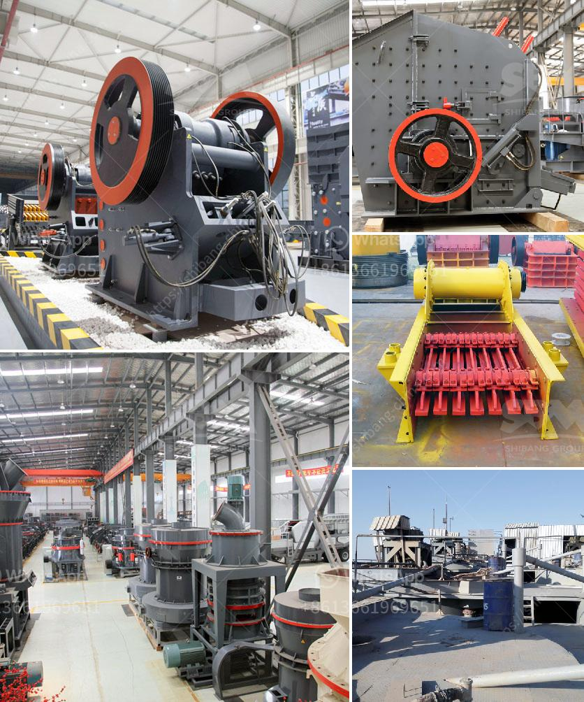

<h3>crusher machine distributor in zambia</h3>
The demand for quality stone products is growing exponentially in Zambia. People have been using stones for various construction purposes throughout history, and now there is a greater emphasis on building homes, offices, and other structures. As a result, the need for equipment like crushing machines is increasing to meet this demand.

Zambia being a conglomerate of 10 provinces, each with its own unique construction needs, has created a market for various stone products, such as road construction materials, concrete bricks, and even sand for construction. This has ultimately led to an increase in the number of crusher machine distributors in the country.

Crusher machines play an essential role in a stone processing line, especially when the rocks are mined from various locations like river beds or mountains. These machines are often seen as ideal for travelers who are constantly moving from one construction site to another. They are designed to reduce the size of large rocks into smaller rocks, gravel, or rock dust, depending on the requirements.

One major advantage of crusher machines is their ability to save time and labor costs. Instead of relying on traditional manual labor-intensive methods of breaking stones, these machines perform the task efficiently and quickly. This not only improves productivity but also ensures a higher quality of crushed stone.

In Zambia, many stone crushing companies have invested in these machines, which creates job opportunities for the people. Due to their easy operation and high efficiency, portable crusher machines are preferred by those planning to establish a new mine or quarry. However, the initial cost of investment for these machines can be high, making them inaccessible for small-scale businesses.

To tackle this challenge, crusher machine distributors in Zambia are advocating for the use of non-explosive rock breaking methods. This technique uses chemicals in small quantities and helps reduce costs, especially when it comes to rock drilling. Non-explosive rock breaking methods also ensure the safety of workers by eliminating the risk of accidents related to explosions.

Additionally, crusher machine distributors in Zambia are privy to a huge amount of valuable information on the products they sell. They are equipped with in-depth knowledge about different types of crushers, ranging from jaw crushers and cone crushers to impact crushers and hammer crushers. This information helps customers make informed decisions and choose the most suitable crushing equipment for their specific needs.

Finally, crusher machine distributors in Zambia improve upon the already impressive machines by constantly upgrading them. They keep up with the latest technological advancements and implement them to enhance the efficiency and reliability of their products. By doing so, they ensure that their customers have access to the most advanced crushing equipment available on the market.

In conclusion, crusher machine distributors in Zambia have made remarkable strides in the stone crushing industry. They provide an invaluable service to the construction industry by providing efficient machines that save time, labor, and costs. Their continuous efforts in improving their products ensure that customers have access to cutting-edge technology, ultimately leading to better construction practices in Zambia.
<h3>Contact us</h3><ul><li><strong>Whatsapp:&nbsp;<a href="https://wa.me/8613661969651">+8613661969651</a></strong></li><li><a href="https://swt.shibang-china.com/?git&amp;zhl&amp;crusher machine distributor in zambia"><strong>Online Service(chat now)</strong></a></li></ul><h3>Related</h3><ul><li><a href='iron slag crusher india.md'>iron slag crusher india</a></li><li><a href='aggregate production line.md'>aggregate production line</a></li><li><a href='grinding roller mill.md'>grinding roller mill</a></li><li><a href='sand making machine price.md'>sand making machine price</a></li><li><a href='vibrating sieving machine.md'>vibrating sieving machine</a></li></ul>