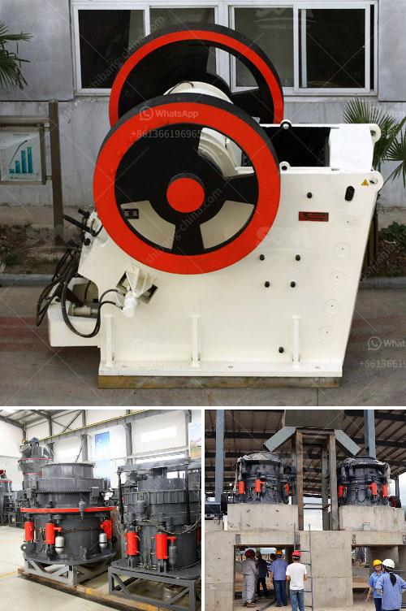

<h3>crusher machine for sale in nepal</h3>
Nepal is a country that is known for its rugged beauty, majestic mountains, and vast plains. In recent years, it has seen a rapid increase in infrastructure development, which has created a huge demand for crusher machines.

With the advent of crusher machines, the construction industry of Nepal has witnessed a major shift in its approach to processing raw materials. The market for crusher machines is expanding steadily, and manufacturers are targeting this demand by producing high-quality machines that are efficient and durable.

Crusher machines are used for crushing stones, rocks, and other hard materials. In Nepal, they are mostly used in construction and mining industries. The machines are designed to crush large-sized rocks into smaller-sized rocks, gravel, or rock dust. These machines also reduce the size or change the form of waste materials for easy disposal or recycling.

One such machine is the jaw crusher. It is a very commonly used crusher in Nepal for crushing stone and rocks into gravel, smaller stones, or even sand. This machine is used in the construction industry for various purposes such as crushing rocks to create strong foundations for buildings, grinding rocks into different sizes for filling roadbeds, and even transforming rocks into gravel or sand for use in manufacturing concrete.

The crusher machine is also used to break down asphalt and concrete waste products into smaller pieces for recycling or disposal. This not only reduces the environmental impact of waste materials but also contributes to the sustainable development of Nepal.

Another popular crusher machine for sale in Nepal is the impact crusher. It is also categorized into two main types: horizontal and vertical shaft impact crushers. These crushers break rock by impacting the rock with hammers or blow bars that are fixed upon the outer edge of a spinning rotor. This type of crusher is mostly used for processing soft and non-abrasive materials.

The cone crusher is another excellent choice for your crushing needs. It works by compressing material between a moving cone and a fixed cone. This machine is widely used in mining, quarrying, recycling, and many other applications. Its ability to crush various types of materials makes it an ideal choice for construction projects.

When considering buying a crusher machine, it is important to take into account various factors such as the desired output size, capacity, power consumption, and maintenance requirements. Additionally, it is advisable to choose a machine that is easy to operate and maintain, ensuring long-term efficient performance.

In conclusion, crusher machines have become an integral part of Nepal's construction industry. The rapid urbanization and infrastructure development have created a huge demand for these machines. With advancements in technology, manufacturers are producing high-quality crushers that are efficient and durable. Jaw crushers, impact crushers, and cone crushers are some of the popular choices for crushing rocks, stones, and waste materials. By utilizing these machines, Nepal can efficiently reduce waste and recycle materials, contributing to a cleaner and more sustainable environment.
<h3>Contact us</h3><ul><li><strong>Whatsapp:&nbsp;<a href="https://wa.me/8613661969651">+8613661969651</a></strong></li><li><a href="https://swt.shibang-china.com/?git&amp;zhl&amp;crusher machine for sale in nepal"><strong>Online Service(chat now)</strong></a></li></ul><h3>Related</h3><ul><li><a href='bauxite crusher machine.md'>bauxite crusher machine</a></li><li><a href='south africa biggest chrome wash plant.md'>south africa biggest chrome wash plant</a></li><li><a href='impact crusher company.md'>impact crusher company</a></li><li><a href='stone crusher machine in russia.md'>stone crusher machine in russia</a></li><li><a href='mini rock crushers.md'>mini rock crushers</a></li></ul>