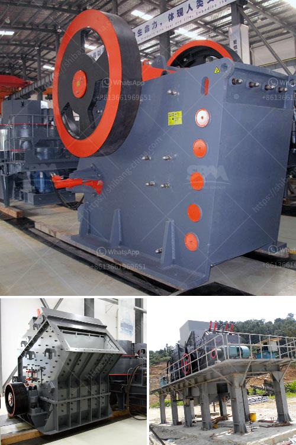

<h3>crusher machine for sale philippines</h3>
A crusher machine is a machine that breaks material, usually rocks, into smaller pieces. Jaw crushers, gyratory crushers, and cone crushers operate by breaking the material between two adjacent surfaces. These machines are widely utilized in the mining and construction industry due to their high efficiency and relatively low cost.

In the Philippines, crusher machines are an essential part of many industrial and materials processing projects. The Philippines is rich in mineral resources, and the mining industry plays a crucial role in the country’s economic development. According to the Philippine Statistics Authority, the mining and quarrying sector contributed 0.6% to the Philippines’ GDP in 2020. With such a significant contribution, the demand for crusher machines for sale in the Philippines has reached new heights.

One type of crusher machine that has gained popularity in the Philippines is the vertical shaft impactor (VSI) crusher. With a high reduction ratio and cubical finish, VSI crushers are ideal for the production of high-quality aggregates. VSI crushers are commonly used in the final stages of the crushing process due to their ability to produce precisely shaped end products.

Another popular type of crusher machine for sale in the Philippines is the cone crusher. Cone crushers are extremely versatile, with multiple applications in the mining and construction industry. They are suitable for crushing various types of rocks, including iron ore, copper ore, limestone, quartz, and granite. Cone crushers offer many benefits, such as high crushing ratio, high efficiency, and low operation costs.

Investing in a crusher machine for sale in the Philippines is a wise decision for businesses involved in the mining and construction industry. Crushers can process materials quickly and efficiently, resulting in high productivity and profitability. Furthermore, crushers allow businesses to process their materials on-site, reducing transportation and storage costs.

There are several factors to consider when purchasing a crusher machine in the Philippines. Firstly, it is crucial to choose a machine that meets the specific requirements of the project. For example, if the project involves crushing hard rock, a machine with high crushing strength and reliable performance is necessary. Additionally, it is essential to consider the equipment’s durability, maintenance requirements, and power consumption, as these factors can affect the overall operational cost.

When searching for a crusher machine for sale in the Philippines, it is advisable to consult with experienced professionals or reputable suppliers. They can provide valuable insights into the various options available and help select the most suitable machine for the specific needs of the business. Additionally, it is advisable to inquire about after-sales services, warranty, and spare parts availability, as these factors can significantly impact the machine’s longevity and operational efficiency.

In conclusion, a crusher machine for sale in the Philippines is a worthwhile investment for businesses in the mining and construction industry. These machines offer high productivity, efficiency, and cost-effectiveness, ultimately leading to increased profitability. However, it is crucial to carefully evaluate the options available and select a machine that best suits the specific requirements of the project. By making an informed decision and consulting with experts, businesses can ensure a successful and profitable investment in a crusher machine in the Philippines.
<h3>Contact us</h3><ul><li><strong>Whatsapp:&nbsp;<a href="https://wa.me/8613661969651">+8613661969651</a></strong></li><li><a href="https://swt.shibang-china.com/?git&amp;zhl&amp;crusher machine for sale philippines"><strong>Online Service(chat now)</strong></a></li></ul><h3>Related</h3><ul><li><a href='brick making machine in zimbabwe.md'>brick making machine in zimbabwe</a></li><li><a href='impact crusher in lima peru.md'>impact crusher in lima peru</a></li><li><a href='jaw crusher 400 600.md'>jaw crusher 400 600</a></li><li><a href='hammer crushers price.md'>hammer crushers price</a></li><li><a href='stone crusher 200 ton per.md'>stone crusher 200 ton per</a></li></ul>