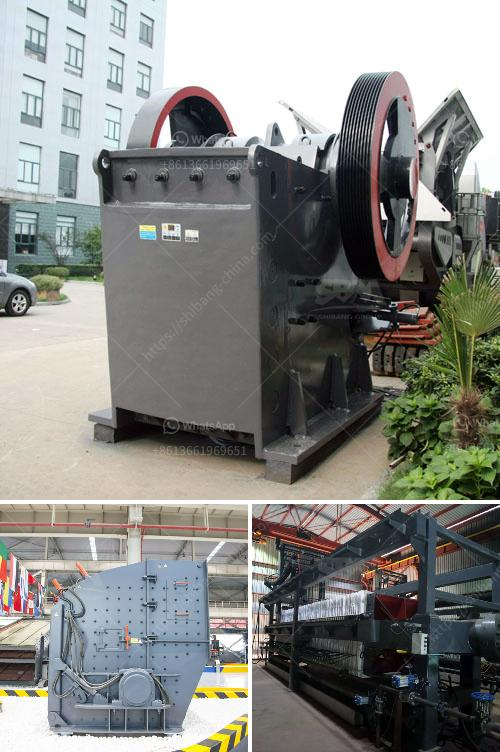

<h3>crusher machine price in pakistan</h3>
As the use of construction materials increases in Pakistan, so does the need for a reliable and efficient crusher machine. This machine is necessary for processing stones and minerals into smaller pieces to make them suitable for construction purposes. Crusher machines are used for crushing stones or rocks into smaller pieces. The machine has a feed opening on top, which allows larger rocks to enter the machine and get crushed into smaller pieces.

The price of crusher machines in Pakistan varies depending on the make, model, and quality. Factors such as the size of crushing capacity, the life span of the machine, construction materials, and additional features contribute to the overall price of the equipment. The market is flooded with a variety of crushers, each designed to cater to a specific crushing requirement.

One of the most common types of crushers is the jaw crusher. It is known for its simplicity and reliability. Jaw crushers have a stationary jaw and a moving jaw, which can be used to crush materials. The moving jaw applies force to the material as it moves downward, effectively crushing it against the stationary jaw. A jaw crusher has a high crushing ratio and is capable of producing uniform-sized particles, making it suitable for various construction projects.

Another type of crusher commonly used in Pakistan is the cone crusher. It has a conical-shaped crushing chamber that allows materials to be crushed by compression. The cone crusher is ideal for crushing hard and abrasive materials. It produces finer and more uniform particles compared to other types of crushers. Additionally, cone crushers are often used in secondary and tertiary crushing stages.

The impact crusher is another popular crusher machine in Pakistan. It uses impact force to crush materials and is capable of producing high-quality stones with less wear and tear. Impact crushers are generally used for soft and non-abrasive materials, such as limestone, phosphate, gypsum, weathered shale, and concrete.

Apart from these common crushers, there are also other specialized crushers available in the market. These include the gyratory crusher, hammer crusher, and vertical shaft impact crusher. Each has its own unique features and applications, catering to specific crushing requirements.

When considering the price of a crusher machine in Pakistan, it is essential to evaluate the long-term investment. While cheaper machines may seem attractive initially, they often result in higher maintenance and repair costs in the long run. Therefore, it is advisable to invest in a quality crusher machine that offers durability and high performance to ensure efficient operations and minimize downtime.

In conclusion, the price of crusher machines in Pakistan varies depending on various factors such as the make, model, and quality. Different types of crushers are available to cater to different crushing requirements. When purchasing a crusher machine, it is important to consider not only the initial price but also the long-term investment in terms of maintenance and repair costs. By making an informed decision, construction companies and individuals can choose the right crusher machine that meets their crushing needs while maximizing their return on investment.
<h3>Contact us</h3><ul><li><strong>Whatsapp:&nbsp;<a href="https://wa.me/8613661969651">+8613661969651</a></strong></li><li><a href="https://swt.shibang-china.com/?git&amp;zhl&amp;crusher machine price in pakistan"><strong>Online Service(chat now)</strong></a></li></ul><h3>Related</h3><ul><li><a href='mill balls for mining.md'>mill balls for mining</a></li><li><a href='precipitated calcium carbonate production plant design.md'>precipitated calcium carbonate production plant design</a></li><li><a href='stone medina stone mobile crusher.md'>stone medina stone mobile crusher</a></li><li><a href='concrete crushing machine for sale.md'>concrete crushing machine for sale</a></li><li><a href='jaw crusher in uae.md'>jaw crusher in uae</a></li></ul>