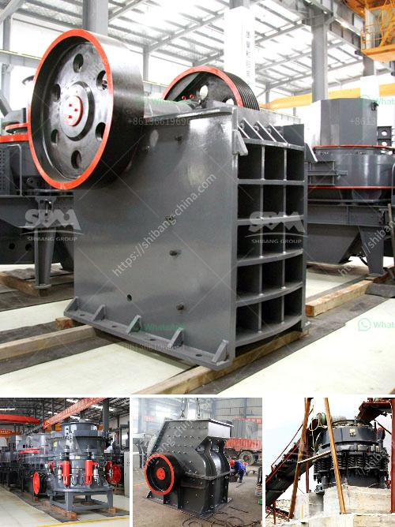

<h3>crusher machine to make fine powder</h3>
Crusher machines are widely used to crush various kinds of minerals and rocks for various purposes like mining, building materials, highways, railways, and chemical industries. One of the most common types of these machines is the jaw crusher, which is used to process concrete, granite, limestone, and other hard materials into fine powder.

The crusher machine works by gradually applying a force to the material, reducing it to a size that is suitable for further processing and improving its value. The process is simple yet highly effective, as it breaks the material into smaller pieces that fall to the bottom before being collected for further processing.

To make fine powder, it is primarily crushed using a series of crushing machines such as jaw crusher, impact crusher, cone crusher, and compound crusher. After the initial crushing, the material is then ground using a variety of grinding mill machines including ball mill, raymond mill, and ultrafine mill.

Each grinding equipment has different functions but the overall goal is to reduce the material into fine powder. Some of the machines with specific functionalities are discussed below:

1. Jaw crusher: This is a primary crusher used for crushing hard, abrasive materials such as granite, basalt, limestone, and concrete. It is commonly used as a first stage crusher in the crushing process.

2. Impact crusher: This machine uses impact force to crush the material and is usually used for medium-hardness materials such as limestone, coal, and clay. It has good reduction ratio and produces fine powder.

3. Cone crusher: This is a secondary crusher that uses the same principle as the gyratory crusher but at a slower speed. It is mainly used in the fine crushing stage of the mineral processing plant.

4. Compound crusher: This machine combines the advantages of a hammer crusher and impact crusher, making it suitable for crushing brittle materials such as coal, limestone, and clay. It has high reduction ratio and produces fine powder.

5. Grinding mill machines: These machines are used to grind various materials into fine powder, including ball mills, raymond mills, and ultrafine mills. The final fineness of the material depends on the size of the grinding media, the rotation speed, and the material properties.

In conclusion, crusher machines are essential equipment in the mineral processing industry, as they reduce the size of the material into fine powder, making it easier to process. They are widely used in various industries, including mining, construction, and chemical industries. With the advancement of technology, these machines are becoming more efficient and effective, allowing for the production of high-quality fine powder.
<h3>Contact us</h3><ul><li><strong>Whatsapp:&nbsp;<a href="https://wa.me/8613661969651">+8613661969651</a></strong></li><li><a href="https://swt.shibang-china.com/?git&amp;zhl&amp;crusher machine to make fine powder"><strong>Online Service(chat now)</strong></a></li></ul><h3>Related</h3><ul><li><a href='sample business plan for crushed stone.md'>sample business plan for crushed stone</a></li><li><a href='impact crusher korea.md'>impact crusher korea</a></li><li><a href='activated carbon crushing machine czech republic.md'>activated carbon crushing machine czech republic</a></li><li><a href='jaw crusher machine.md'>jaw crusher machine</a></li><li><a href='crawler type mobile crusher.md'>crawler type mobile crusher</a></li></ul>