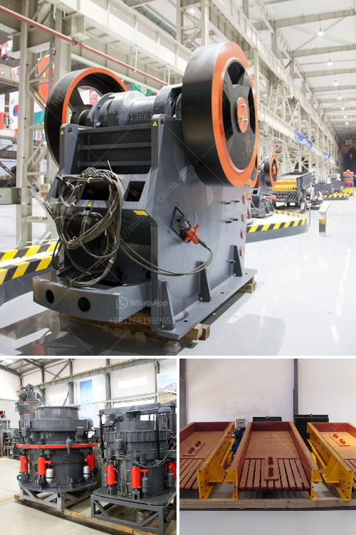

<h3>crusher machine vendor in penang</h3>
Penang, known as the Pearl of the Orient, has a vibrant industrial sector that contributes significantly to Malaysia's economy. One crucial aspect of this booming industry is the presence of crusher machine vendors. These vendors play a vital role in providing the machinery required for various construction and manufacturing operations.

Penang is home to numerous crusher machine vendors, each specializing in different types of machines and catering to a wide range of industries. From small-scale businesses to large multinational corporations, these vendors offer a diverse selection of crushers to meet the unique requirements of their customers.

Crusher machines are essential for crushing rocks, stones, ores, and other raw materials to obtain the desired size and shape. They are widely used in construction projects, road building, mining operations, and even recycling processes. These machines come in different designs and capacities, ensuring there is a suitable option for every project.

To ensure quality and reliability, crusher machine vendors in Penang source their products from renowned manufacturers. These manufacturers adhere to strict quality control measures to deliver efficient, durable, and high-performing machines. By offering top-of-the-line products, these vendors have earned a reputation for providing excellent customer satisfaction.

One such reputable crusher machine vendor in Penang is XYZ Machinery. They have been operating for over two decades and have established themselves as a trusted supplier in the industry. XYZ Machinery offers a comprehensive range of crushers, including jaw crushers, cone crushers, impact crushers, and even mobile crushers. They aim to provide reliable solutions that increase productivity and reduce operational costs for their customers.

When selecting a crusher machine vendor, it's essential to consider factors such as after-sales service, spare parts availability, and technical support. XYZ Machinery understands the importance of these aspects and ensures prompt assistance whenever required. They have a dedicated team of highly trained professionals who offer guidance, troubleshooting, and maintenance services to ensure the smooth operation of their machines.

Furthermore, crusher machine vendors in Penang are conscious of environmental concerns. They strive to provide eco-friendly options that minimize pollution and energy consumption. Many modern crushers incorporate advanced technologies that reduce dust emission, noise levels, and energy usage. XYZ Machinery, for instance, offers crushers with efficient engines and noise reduction features to contribute to a greener and more sustainable future.

In conclusion, crusher machine vendors in Penang play a crucial role in the industrial landscape. They provide essential machinery that aids in various construction and manufacturing operations. With their comprehensive range of crushers and commitment to quality, these vendors ensure that their customers have access to reliable and efficient machines. Moreover, their focus on after-sales service and environmental sustainability sets them apart from the competition. Whether you're involved in road building, mining, or recycling, it's imperative to partner with a reputable crusher machine vendor in Penang.
<h3>Contact us</h3><ul><li><strong>Whatsapp:&nbsp;<a href="https://wa.me/8613661969651">+8613661969651</a></strong></li><li><a href="https://swt.shibang-china.com/?git&amp;zhl&amp;crusher machine vendor in penang"><strong>Online Service(chat now)</strong></a></li></ul><h3>Related</h3><ul><li><a href='crushers for sale in.md'>crushers for sale in</a></li><li><a href='manufacture of a cone crusher.md'>manufacture of a cone crusher</a></li><li><a href='used ball mills philippines.md'>used ball mills philippines</a></li><li><a href='project report of a tph stone crusher.md'>project report of a tph stone crusher</a></li><li><a href='pf series impact crushers in alibaba.md'>pf series impact crushers in alibaba</a></li></ul>