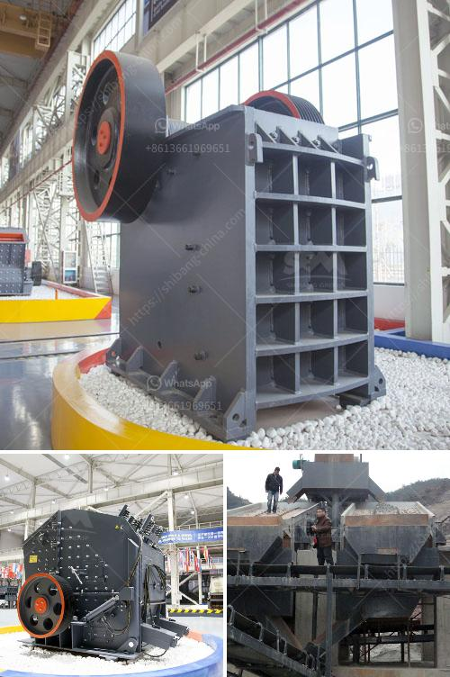

<h3>crusher manufacturers in russia</h3>
Russia is a vast country with an abundance of natural resources. As such, it has been a prime market for crushers in the past few decades due to the increasing demand for gravel, stones, and construction aggregates. Russia has a long history of industrial development, and many companies operating in the country have recognized the potential of the crusher market. This has led to the emergence of numerous crusher manufacturers in Russia.

Russian crusher manufacturers have played a major role in the country's mining industry, providing high-quality equipment for various applications. Their product range includes crushers, screens, feeders, track-mounted crushers, portable crushers, and recycling crushers. With the growing demand for construction materials in Russia, crusher manufacturers have focused on improving their product offerings to cater to different customer requirements.

One notable crusher manufacturer in Russia is Unigran. The company's machines are highly sought after by the mining industry for their reliability, efficiency, and durability. Unigran offers a wide range of stationary and mobile crushers suitable for various applications. Additionally, the company provides comprehensive after-sales service and technical support to ensure customer satisfaction.

Another prominent crusher manufacturer in Russia is Uralmashplant. Uralmash is a well-established company with a strong presence in the Russian market. It specializes in the design and production of heavy-duty crushers and grinding mills for various industries, including mining, cement, and aggregates. Uralmashplant's crushers are known for their robustness and long lifespan, making them a preferred choice for many companies operating in Russia.

Apart from Unigran and Uralmashplant, there are several other crusher manufacturers in Russia that contribute to the country's mining industry. These companies include NPO Center, Techstroy, Gornye Tekhnologii, and many others. They offer a wide range of crushers suitable for different applications and customer needs.

Crusher manufacturers in Russia constantly strive to improve their products to meet the changing demands of the market. They invest in research and development to introduce advanced technology and enhance the performance of their machines. For instance, many Russian crusher manufacturers have adopted automation and control systems to improve operational efficiency and reduce downtime.

In recent years, sustainability has become an important consideration for crusher manufacturers in Russia. They have started focusing on environmentally friendly solutions and developing crushers that consume less energy and produce less pollution. This shift towards sustainable practices not only benefits the environment but also enhances the overall reputation of the crusher manufacturers in the market.

In conclusion, crusher manufacturers in Russia have been instrumental in catering to the growing demand for construction materials. They offer a wide range of crushers suitable for various applications, backed by comprehensive after-sales support. Through continuous research and development, these manufacturers strive to improve their products and provide sustainable solutions. With the growing importance of the mining industry in Russia, the demand for crushers is likely to continue increasing, driving further innovation in the market.
<h3>Contact us</h3><ul><li><strong>Whatsapp:&nbsp;<a href="https://wa.me/8613661969651">+8613661969651</a></strong></li><li><a href="https://swt.shibang-china.com/?git&amp;zhl&amp;crusher manufacturers in russia"><strong>Online Service(chat now)</strong></a></li></ul><h3>Related</h3><ul><li><a href='price and 900 stone crusher.md'>price and 900 stone crusher</a></li><li><a href='crusher plant in sargodha.md'>crusher plant in sargodha</a></li><li><a href='portable crushers.md'>portable crushers</a></li><li><a href='equipment needed for quarry crusher.md'>equipment needed for quarry crusher</a></li><li><a href='buy stone crusher machine in saudi arabia.md'>buy stone crusher machine in saudi arabia</a></li></ul>