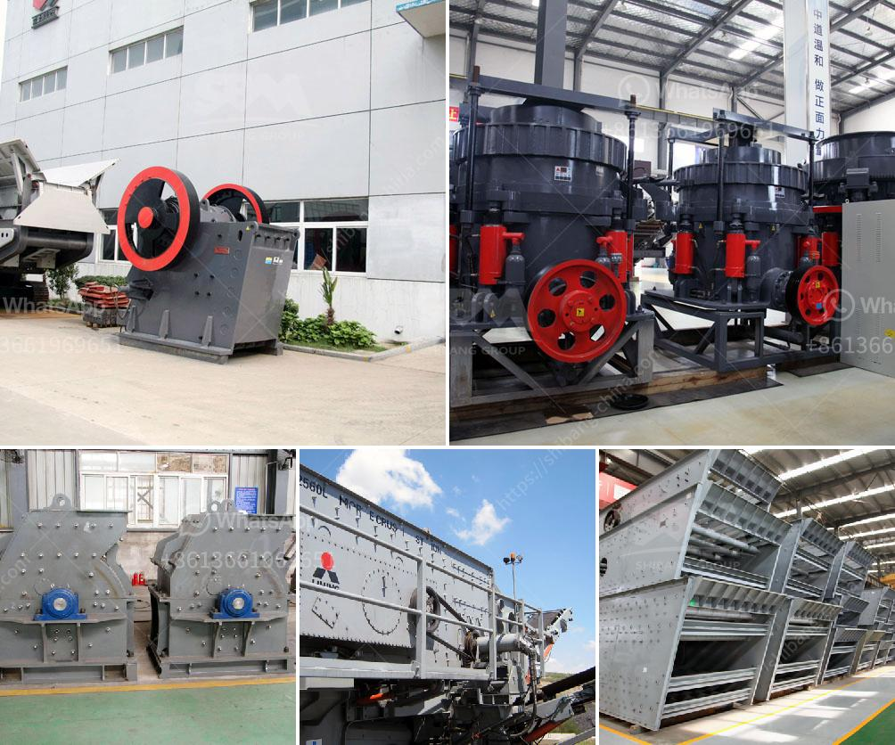

<h3>crusher mill sales in malaysia</h3>
Malaysia, a Southeast Asian nation known for its vibrant economy, is witnessing a substantial surge in crusher mill sales. This has become a booming market for industrial equipment, with numerous businesses investing in advanced machinery to meet the increasing demand.

A crusher mill is a machine that utilizes rotating hammers or blades to break materials into smaller pieces, facilitating easier handling, transportation, and subsequent processing. These machines are extensively used in various industries such as mining, construction, and agriculture to reduce the size of raw materials.

One of the key factors driving the growth of the crusher mill market in Malaysia is the expanding construction industry. The country is experiencing rapid urbanization, leading to a rise in infrastructure projects – from residential buildings to commercial complexes. Crusher mills are crucial for crushing and grinding construction materials like stones, rocks, and concrete, enabling the production of raw materials essential for construction projects.

Additionally, Malaysia is rich in natural resources, particularly in the mining sector. The need to process minerals like iron ore, coal, and gold has intensified, creating a significant demand for crusher mills. These machines efficiently break down large chunks of ore into smaller pieces, making them easier to transport and process further.

Furthermore, the agriculture sector relies heavily on crusher mills for various applications. This includes processing agricultural waste, such as rice husk and palm fibre, which can be transformed into useful products like animal bedding, fuel pellets, or compost. Moreover, crusher mills are also used to grind corn, wheat, and other crops, enabling the production of animal feed and other food processing applications.

To cater to this growing demand, several global and local manufacturers are offering a wide range of crusher mills tailored for the Malaysian market. These mills are designed using the latest technology to ensure enhanced efficiency, productivity, and durability.

In conclusion, the crusher mill sales in Malaysia have witnessed a significant increase due to various factors such as the booming construction industry, mining activities, and agricultural processing needs. As the country continues to grow and evolve, the demand for these versatile machines is projected to rise further. By investing in advanced crusher mills, businesses can secure their position in this thriving market and contribute to the nation's economic development.
<h3>Contact us</h3><ul><li><strong>Whatsapp:&nbsp;<a href="https://wa.me/8613661969651">+8613661969651</a></strong></li><li><a href="https://swt.shibang-china.com/?git&amp;zhl&amp;crusher mill sales in malaysia"><strong>Online Service(chat now)</strong></a></li></ul><h3>Related</h3><ul><li><a href='slag crushing machine.md'>slag crushing machine</a></li><li><a href='gravel crushing machine.md'>gravel crushing machine</a></li><li><a href='cement grinding mill in bangladesh.md'>cement grinding mill in bangladesh</a></li><li><a href='sand beneficiation plant technology.md'>sand beneficiation plant technology</a></li><li><a href='crushing and serreing machinery.md'>crushing and serreing machinery</a></li></ul>