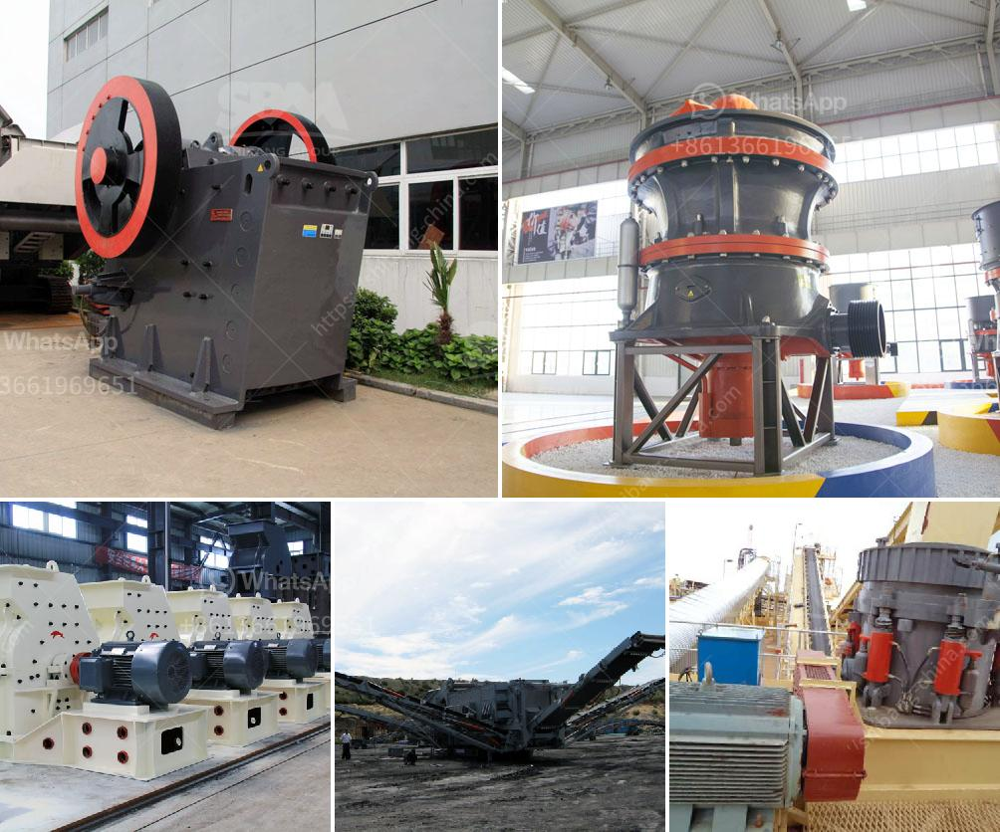

<h3>crusher near sale saudi arabia</h3>
In Saudi Arabia, construction projects have been thriving over the years. With the rapid growth in population and infrastructure development, the demand for construction materials has skyrocketed. This has led to an increased need for crushers, which are indispensable machines used for crushing various materials into smaller sizes.

A crusher plays a vital role in the construction industry, as it helps in transforming large rocks, concrete, gravel, and other materials into usable aggregate. It serves as an essential tool for contractors, builders, and infrastructure developers, enabling them to carry out their projects efficiently.

As the demand for crushers has surged, numerous crusher near sale options have emerged in Saudi Arabia. These offer convenient access to crushers for individuals and businesses involved in construction works. The crushers available are versatile, capable of handling different types of materials and producing various finished products. This ensures that their usage is not limited to a single industry or application.

Moreover, crusher near sale locations in Saudi Arabia also provide timely maintenance and repair services. This ensures that the machines continue to operate at their optimum level, reducing downtime and enhancing productivity at construction sites. With skilled technicians and well-equipped facilities, these crusher near sale ventures offer prompt assistance to their customers, ensuring uninterrupted progress in construction activities.

The availability of crusher near sale Saudi Arabia has greatly benefited construction projects in the region. It has saved time and effort for contractors, as they can quickly access crushers for their specific requirements. Additionally, it has significantly reduced transportation costs, enabling projects to stay within their budget limits.

In conclusion, having crusher near sale options in Saudi Arabia proves to be a convenient solution for the construction industry. This availability ensures that crushers are easily accessible to contractors, helping them carry out their projects efficiently. Not only does it save time and resources, but it also contributes to the overall growth and development of Saudi Arabia's construction sector.
<h3>Contact us</h3><ul><li><strong>Whatsapp:&nbsp;<a href="https://wa.me/8613661969651">+8613661969651</a></strong></li><li><a href="https://swt.shibang-china.com/?git&amp;zhl&amp;crusher near sale saudi arabia"><strong>Online Service(chat now)</strong></a></li></ul><h3>Related</h3><ul><li><a href='price jaw crusher price stone crusher.md'>price jaw crusher price stone crusher</a></li><li><a href='200 tph crusher plant.md'>200 tph crusher plant</a></li><li><a href='mill gypsum for sale in india.md'>mill gypsum for sale in india</a></li><li><a href='harga impact crusher.md'>harga impact crusher</a></li><li><a href='3 roller mill and new zealand.md'>3 roller mill and new zealand</a></li></ul>