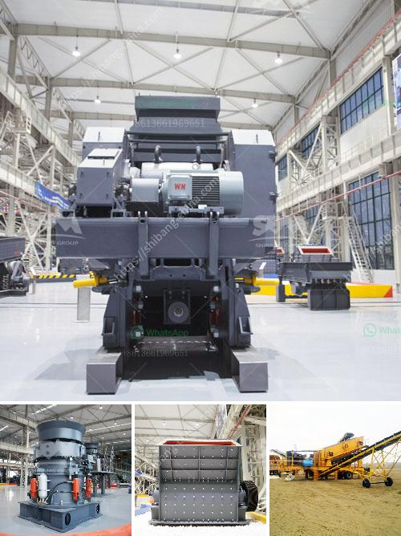

<h3>crusher peru price crushing plant</h3>
Peru, known for its rich mineral resources, has attracted numerous mining companies over the years. To efficiently extract and process these minerals, a reliable crushing plant is crucial. A crusher plant is used to break down the large rocks into smaller, more manageable sizes for further processing. However, finding an affordable crushing plant that meets your specific requirements can be quite challenging.

One of the leading solutions in the market when it comes to crusher Peru price is offered by reputable manufacturers who understand the needs of their customers. These manufacturers have been designing and manufacturing top-quality crushing plants for many years, meeting the ever-growing demands of the mining industry.

The crusher Peru price varies depending on the size and capabilities of the crushing plant. A plant suitable for small-scale mining operations might cost less compared to a larger plant designed for high-capacity production. The price will also depend on the specific features and optional extras that you may require.

When considering the crusher Peru price, it's important to evaluate the overall value for money. Instead of solely focusing on the initial cost, it is crucial to assess the long-term benefits of the crushing plant. Factors such as durability, ease of maintenance, energy efficiency, and overall performance should be taken into account.

A reliable crushing plant will not only offer superior crushing capabilities but will also ensure minimal downtime and reduced operating costs in the long run. It's essential to select a crusher Peru price that provides exceptional value and meets or exceeds industry standards.

Some manufacturers offer specialized consulting services to help customers choose the most suitable crushing plant for their specific needs. These consultations take into consideration factors such as the type of minerals to be processed, production capacity requirements, and the available budget. By providing tailored solutions, these manufacturers ensure that customers make well-informed decisions and maximize the return on their investment.

In conclusion, crushing plants are integral to the mining industry in Peru. When searching for a crusher Peru price, it's important to focus on finding a reliable, high-quality plant that offers excellent value for money. Investing in the right crushing plant will not only enhance productivity but also ensure the long-term success of your mining operations.
<h3>Contact us</h3><ul><li><strong>Whatsapp:&nbsp;<a href="https://wa.me/8613661969651">+8613661969651</a></strong></li><li><a href="https://swt.shibang-china.com/?git&amp;zhl&amp;crusher peru price crushing plant"><strong>Online Service(chat now)</strong></a></li></ul><h3>Related</h3><ul><li><a href='sand washing plants.md'>sand washing plants</a></li><li><a href='grinding or crushing for gypsum pdf.md'>grinding or crushing for gypsum pdf</a></li><li><a href='stone crushers in kenya.md'>stone crushers in kenya</a></li><li><a href='gypsum powder price in south africa.md'>gypsum powder price in south africa</a></li><li><a href='second hand equipment for sale in south africa.md'>second hand equipment for sale in south africa</a></li></ul>