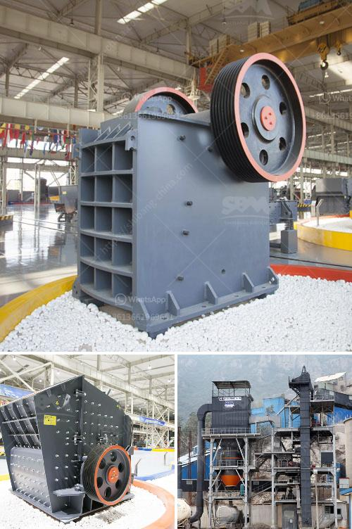

<h3>crusher plant business requirement in paistan</h3>
Pakistan is a rapidly developing country in terms of infrastructure, construction, and mining industries. This growth brings the need for efficient and reliable crusher plants that can fulfill their requirements at a fast pace. To cater to these needs, there has been a significant surge in investment in the construction and mining sectors in Pakistan in recent years. Therefore, setting up a crusher plant is a lucrative opportunity for entrepreneurs looking to venture into the crusher plant business in Pakistan.

Crusher plants are necessary for the construction and mining industry to produce gravel, stones, and other materials used in road construction, buildings, and bridges. They maintain a constant supply of raw materials to ensure the construction projects are carried out seamlessly and efficiently. While in the mining industry, crushers are used to crush large rocks or ores into smaller pieces to be further processed.

Before starting a crusher plant, it is crucial to understand the requirements for the crushing process. Well-designed crusher plants with optimized efficiency and reliability have a vast impact on the profitability of the business. These factors should be considered while designing the plant layout and choosing the equipment:

1. Location: Selecting an appropriate location for the crusher plant is of utmost importance. The site should be accessible to trucks for easy transportation of raw materials and finished products. Additionally, it should comply with environmental regulations and not interfere with the surrounding residential areas.

2. Machinery and equipment: The right machinery and equipment are essential for the crusher plant business. Here are some key factors to consider:

     a. Type of crushers: There are various types of crushers available in the market, including cone crushers, jaw crushers, impact crushers, and gyratory crushers. Each type has its specific features and advantages. The selection of the appropriate type depends on the desired output, size of raw materials, and the budget of the investment.

     b. Feeding equipment: Crushers require a constant and uniform supply of raw materials. Vibrating feeders or grizzly feeders are commonly used to control the flow of oversized material into the crushers.

     c. Conveyors: Conveyors are crucial to transport the crushed materials from one stage to another. Proper conveyors help in minimizing the handling time and ensure the smooth flow of materials.

3. Skilled workforce: Employing a skilled workforce is essential for the successful operation of a crusher plant. The workforce should include operators, maintenance technicians, and supervisors who are trained to operate the machinery and tackle any maintenance issues that may arise.

4. Maintenance and safety: Regular maintenance of the crusher plant is crucial to avoid any breakdowns or production losses. Establishing a comprehensive maintenance and safety plan will ensure a safe working environment for the employees and prevent any accidents.

5. Financial aspects: A well-crafted business plan is essential to attract investors or secure financing for the crusher plant business. The plan should outline the projected financials, market analysis, and the marketing strategies to reach potential customers.

In conclusion, setting up a crusher plant business in Pakistan is a viable opportunity for both small and large entrepreneurs. The crushing process involves multiple stages of crushing, screening, and conveying to ensure proper size reduction and handling of raw materials. Being aware of the requirements for the crusher plants in Pakistan can help investors understand the profitability of the business and make wise investment decisions.
<h3>Contact us</h3><ul><li><strong>Whatsapp:&nbsp;<a href="https://wa.me/8613661969651">+8613661969651</a></strong></li><li><a href="https://swt.shibang-china.com/?git&amp;zhl&amp;crusher plant business requirement in paistan"><strong>Online Service(chat now)</strong></a></li></ul><h3>Related</h3><ul><li><a href='chinese stone crusher machine.md'>chinese stone crusher machine</a></li><li><a href='power of a roller mill.md'>power of a roller mill</a></li><li><a href='kenya quartz crushing.md'>kenya quartz crushing</a></li><li><a href='stone crushing plant cost in pakistan.md'>stone crushing plant cost in pakistan</a></li><li><a href='powder making machines.md'>powder making machines</a></li></ul>