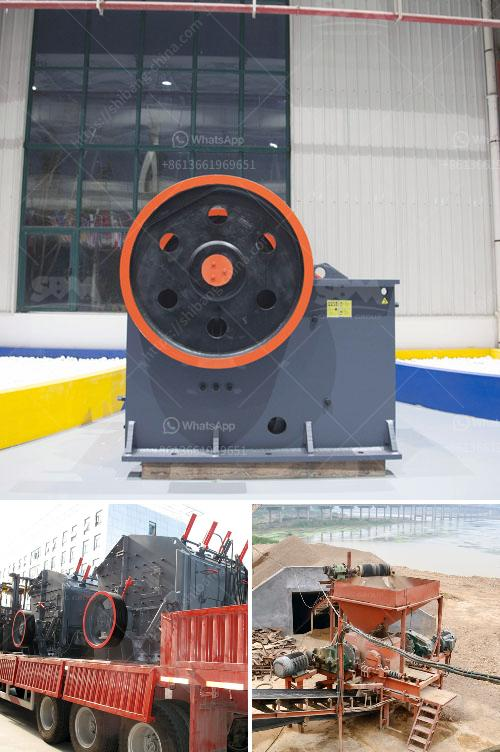

<h3>crusher plant for coal for sale in south africa</h3>
Coal plays a key role in the production of electricity in South Africa. Coal-fired power stations are reliable and monitored around the clock to ensure a consistent supply of electricity. In addition to coal, South Africa also has large deposits of other minerals, enhancing its position as a leading global supplier in the mining sector.

One of the most important aspects of coal mining is the crushing process. As the coal is extracted from the earth, it needs to be crushed for further processing. The crushing process ensures that the coal particles have a consistent size that allows for efficient combustion in power plants.

To meet the increasing demand for coal in South Africa, Eskom has made various commitments to address the environmental impact of coal-fired power generation. Eskom has partnered with Greening the Future, a nonprofit organization, to rehabilitate mining areas and promote sustainable coal mining practices.

To support these efforts, crusher plants for coal are becoming increasingly popular in South Africa. These machines can be used for crushing coal into different sizes, ensuring the optimal combustion of coal and preventing any problems that may arise from insufficient burning. To ensure the high quality of coal for power plants, the mining process often involves several stages, including blasting, excavating, and crushing.

Crusher plants for coal are also used for the crushing of other minerals, such as iron ore and gold. Coal is not the only mineral that is mined and crushed in South Africa. Mining companies also take advantage of the immense resources of South Africa's gold deposits and utilize crushing plants to process the extracted materials. These plants ensure that the gold is crushed into the desired sizes and properly prepared for subsequent processing.

In South Africa, crusher plants for coal for sale have proven to be increasingly popular in the mining industry. This is because coal has played a vital role in driving economic growth in the country, and the extraction of coal allows for the development of essential infrastructure such as roads, railways, and ports.

The demand for coal in South Africa is expected to continue to increase in the coming years. As a result, there is a growing need for efficient crushers that can process coal at a high rate and with the utmost precision. Investing in crusher plants for coal for sale in South Africa will help your company increase its production and profits.

Crusher plants for coal are also increasingly sought after by many African countries, especially those near South Africa. Examples of these countries include Botswana, Mozambique, and Zambia. They are mainly investing in crushers to ensure a reliable supply of coal and other minerals for their respective power generation and processing industries.

In conclusion, crusher plants for coal for sale in South Africa have a wide range of applications for the mining industry. Crushers are an essential part of the production process and are increasingly being used to meet the growing demand for coal and other minerals in South Africa and neighboring countries. With the increasing investment in coal mining, crusher plants for coal for sale are becoming more and more popular in South Africa.
<h3>Contact us</h3><ul><li><strong>Whatsapp:&nbsp;<a href="https://wa.me/8613661969651">+8613661969651</a></strong></li><li><a href="https://swt.shibang-china.com/?git&amp;zhl&amp;crusher plant for coal for sale in south africa"><strong>Online Service(chat now)</strong></a></li></ul><h3>Related</h3><ul><li><a href='gold processing per hour.md'>gold processing per hour</a></li><li><a href='carbonate from barite manufacturing process.md'>carbonate from barite manufacturing process</a></li><li><a href='grinding mill prices in harare.md'>grinding mill prices in harare</a></li><li><a href='distributors of conveyor belts in mexico.md'>distributors of conveyor belts in mexico</a></li><li><a href='sewa mesin jaw crusher.md'>sewa mesin jaw crusher</a></li></ul>