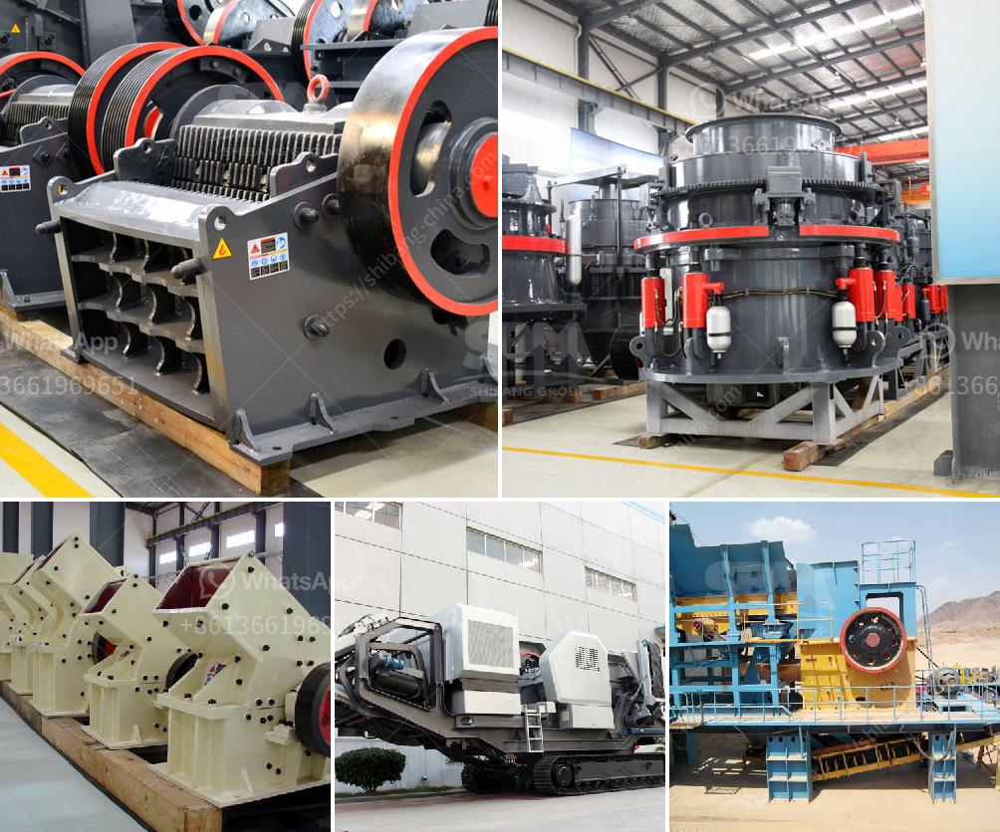

<h3>crusher plant for sale</h3>
Crusher plant is one of the main types of primary crushers in a mine or ore processing plant. Crusher plants are widely used in stone mining, metallurgy industry, building material, highway, railway, water conservancy and chemical industries. Various materials with compression resistance less than 320MPa can be crushed. This series of jaw crusher can reach the crushing ratio of 4-6 and the shape of final product is even. Because it is primary crusher, Jaw crusher is designed for long life service with minimum maintenance for hard, tough, abrasive material and overload high capacity.

Crusher plants are designed based on the characteristics of the materials to be processed to ensure the highest possible crushing efficiency, and the presence of uncrushable materials may affect the crusher plant’s performance. The primary operating costs of a crusher plant, such as electricity, fuel, lubrication, maintenance, plant hire, and operator wages, can be divided into two categories: fixed costs and variable costs. Fixed costs, which include upfront capital expenditure, are usually incurred once at the beginning of the plant’s operational life. Variable costs, such as maintenance and fuel, are incurred continuously throughout the plant’s operational life.

The availability of crusher plant for sale in various configurations ensures that all desired product specifications can be achieved and customer satisfaction is maximized. This is achieved through features such as higher crushing speed, optimized kinematics, and longer stroke. Available models range from the highly compact, with a capacity of 10 tons per hour, to the large-scale crusher plant with a capacity of 300-500 tons per hour.

It is important to select a crusher plant that suits your needs and requirements. The primary factors to consider include the production rate, required specifications of the end product, and the investment cost involved. It is wise to compare multiple crusher plants to find the best one that meets your specific needs.

In addition to the primary crusher, the crusher plant often includes a secondary crushing unit, which can be used for the intermediate and fine crushing processes. Secondary crushers can be cone crushers, hammer crushers, or impact crushers. The choice of secondary crusher depends on the desired product shape and size requirements.

In conclusion, crusher plants play a crucial role in the construction industry, and selecting the right crusher plant for sale is crucial for ensuring the desired end product specification and production volume. crusher plants can also be customized to accommodate different material and capacity requirements, and are available in various configurations to suit individual needs. With the advancement of technology, crusher plants are becoming more automated and recognized for their efficient and safe operation.
<h3>Contact us</h3><ul><li><strong>Whatsapp:&nbsp;<a href="https://wa.me/8613661969651">+8613661969651</a></strong></li><li><a href="https://swt.shibang-china.com/?git&amp;zhl&amp;crusher plant for sale"><strong>Online Service(chat now)</strong></a></li></ul><h3>Related</h3><ul><li><a href='cement grinding mills.md'>cement grinding mills</a></li><li><a href='mobile jaw crusher nigeria.md'>mobile jaw crusher nigeria</a></li><li><a href='chili grinding milling.md'>chili grinding milling</a></li><li><a href='stone crusher 80 tons of jam.md'>stone crusher 80 tons of jam</a></li><li><a href='coal processing plant maintenance.md'>coal processing plant maintenance</a></li></ul>