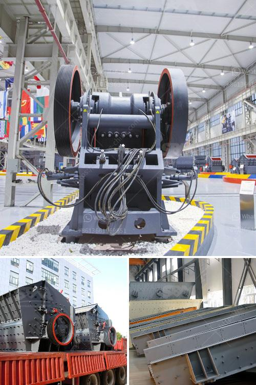

<h3>crusher plant in malaysia</h3>
Crusher plant, also known as crushing plant, is an essential piece of machinery for any construction site. It comprises a range of equipment, including jaw crusher, impact crusher, cone crusher, vibrating screen, and also dust suppression system. All these components work together to create a highly efficient and effective crushing operation.

In Malaysia, the construction industry is booming due to the rapid urbanization and infrastructure development projects. This has led to an increased demand for aggregates, which are materials used in construction, such as crushed stone, gravel, sand, and concrete. To meet these growing demands, crusher plants have become essential to produce the required materials.

One of the key advantages of crusher plants is their versatility. They can process various types of materials, including limestone, granite, basalt, river pebbles, and more. This flexibility allows contractors to produce different sizes and grades of aggregates to meet specific project requirements.

Furthermore, crusher plants in Malaysia are designed to reduce large rocks into smaller, more manageable sizes. This enables transportation and delivery of the materials to construction sites more conveniently. It also eases the process of mixing aggregates with other materials to create concrete, asphalt, and other construction products.

Another crucial aspect of crusher plants in Malaysia is their efficiency. Advanced technology and modern design have made crushing machines more efficient, reducing energy consumption and increasing productivity. This not only saves time and money but also reduces environmental impact.

Moreover, crusher plants in Malaysia are equipped with sophisticated systems to control dust emissions. Dust can be a major concern during the crushing process, but these systems help to contain and manage the dust, ensuring a healthier and safer work environment.

In conclusion, crusher plants in Malaysia play a vital role in the construction industry by providing the necessary materials for infrastructure development. Their versatility, efficiency, and advanced features make them essential machinery for any construction site. As the demand for aggregates continues to grow, crusher plants will continue to play a pivotal role in Malaysia's construction industry.
<h3>Contact us</h3><ul><li><strong>Whatsapp:&nbsp;<a href="https://wa.me/8613661969651">+8613661969651</a></strong></li><li><a href="https://swt.shibang-china.com/?git&amp;zhl&amp;crusher plant in malaysia"><strong>Online Service(chat now)</strong></a></li></ul><h3>Related</h3><ul><li><a href='build a rock crusher.md'>build a rock crusher</a></li><li><a href='vertical roller grinding mill for sale.md'>vertical roller grinding mill for sale</a></li><li><a href='graphite production line.md'>graphite production line</a></li><li><a href='grinding mill of cerial in ethiopia.md'>grinding mill of cerial in ethiopia</a></li><li><a href='consumption of ball mill with roller.md'>consumption of ball mill with roller</a></li></ul>