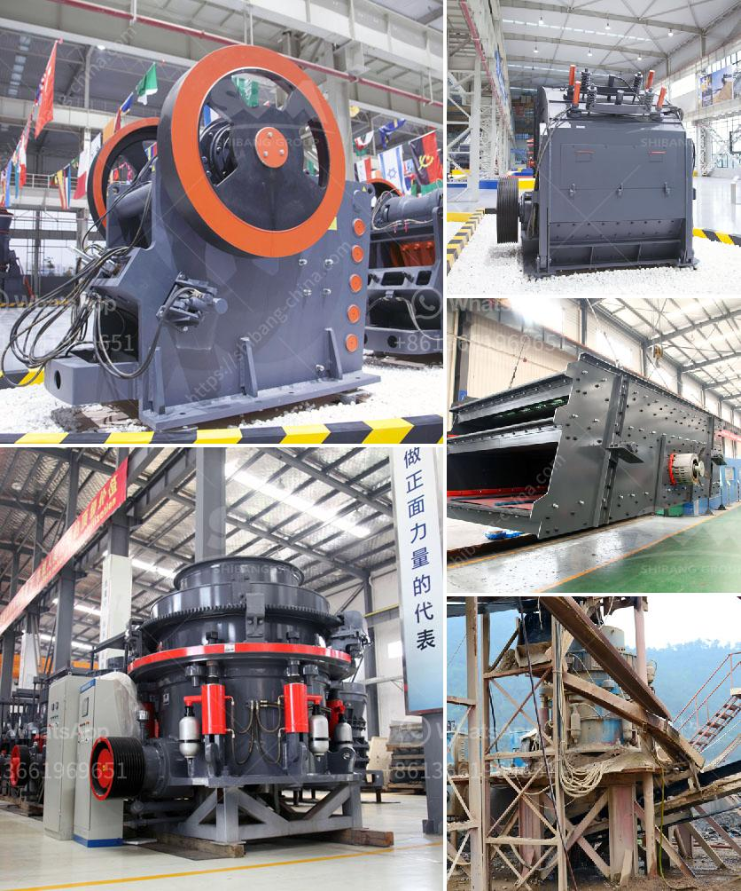

<h3>crusher plant in sargodha</h3>
Crusher plant in Sargodha is one of the leading cement manufacturing industries in the city. The plant is located in the heart of Sargodha, directly adjacent to the Sargodha-Mianwali road, which connects it to the main city. Moreover, the plant is easily accessible for transportation as it is situated just a few kilometers away from the Sargodha-Faisalabad road.

The Sargodha crusher plant has a capacity to crush 400 metric tons of rock per hour. This crushing process ensures that the crushed material is of uniform size and shape and suitable for a variety of construction purposes, including road building, concrete manufacturing, and asphalt production.

The crusher plant employs a range of machinery, including high-quality jaw crushers, cone crushers, impact crushers, and double-deck vibrating screens. This machinery is carefully selected to ensure that it can handle the various types of rocks and materials found in the region.

One of the standout features of the Sargodha crusher plant is its dust suppression system. The plant is equipped with state-of-the-art dust control systems, which effectively minimize the emission of dust particles during the crushing process. This significantly reduces the environmental impact and ensures a healthier working environment for the staff.

In addition to its crushing capabilities, the crusher plant in Sargodha also has its own fully automated concrete batching plant. This plant is responsible for producing high-quality concrete, which meets the specifications and requirements of various construction projects. The plant follows strict quality control measures to ensure that the concrete produced is durable, long-lasting, and capable of withstanding rigorous conditions.

The Sargodha crusher plant is committed to environmental sustainability and makes use of recycled materials whenever possible. In line with this commitment, the plant incorporates recycled aggregates in its production process, reducing the need for extracting new materials from quarries. This not only conserves natural resources but also helps to reduce the carbon footprint of the plant.

Furthermore, the crusher plant in Sargodha actively participates in community development initiatives. It provides employment opportunities to the local population and contributes to the growth of the region's economy. The plant also ensures that its operations do not disrupt the local community, employing best practices for noise reduction and waste management.

Overall, the crusher plant in Sargodha plays a significant role in the construction industry of the city. Its efficient crushing process, use of advanced machinery, commitment to environmental sustainability, and active involvement in community development all contribute to its reputation as a reliable and responsible cement manufacturing industry.
<h3>Contact us</h3><ul><li><strong>Whatsapp:&nbsp;<a href="https://wa.me/8613661969651">+8613661969651</a></strong></li><li><a href="https://swt.shibang-china.com/?git&amp;zhl&amp;crusher plant in sargodha"><strong>Online Service(chat now)</strong></a></li></ul><h3>Related</h3><ul><li><a href='small scale gold mining professional equipment.md'>small scale gold mining professional equipment</a></li><li><a href='cost of tonne per day cement plant.md'>cost of tonne per day cement plant</a></li><li><a href='stone crusher equipment for sale.md'>stone crusher equipment for sale</a></li><li><a href='cement grinding mills.md'>cement grinding mills</a></li><li><a href='prices of vibrating screens.md'>prices of vibrating screens</a></li></ul>