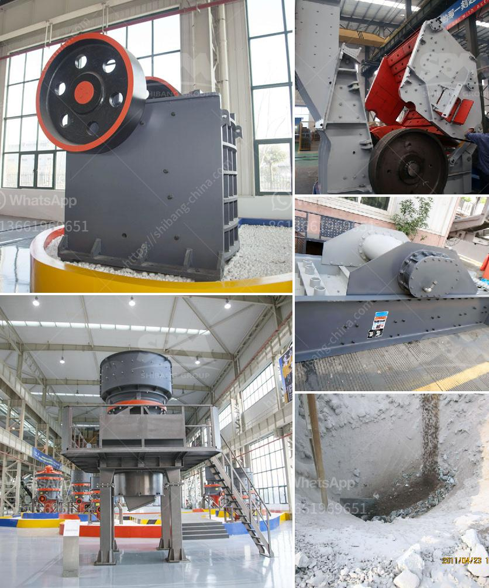

<h3>crusher plant layout</h3>
Crusher plant layout is the previous conditions of mining process. Crushing plant layout is widy used to limestone, clay, sandstone, clinker, gypsum, coal and many other ores and metallic and nonmetallic. Crusher plant layout is the previous conditions of mining process. Crushing plant layout is widy used to limestone, clay, sandstone, clinker, gypsum, coal and many other ores and metallic and nonmetallic.

We have 30 years in developing and supplying stone crushing solutions. Our company offers personal attention to each and every client right from the time when he places an enquiry with the company to the job completion. It strives to provide its clients with high caliber mobile crushing solutions at fair pricing.

Productive and versatile, the cone crusher is readily mounted and easily transportable on a portable cone/ screen chassis. The 350 is a smart cone crusher with advanced control systems. Raptor 450. The Raptor 450 cone crusher is ideal as a secondary crusher following a Jaw. This machine gives you more usable and saleable aggregate per ton processed than competitive models in its class.

Crusher plant layout is the previous conditions of mining process. Crushing plant layout is widy used to limestone, clay, sandstone, clinker, gypsum, coal and many other ores and metallic and nonmetallic. We provide all types of stone crushing machine for sale, including jaw crusher, impact crusher, cone crusher, mobile crusher, etc. Due to the advantages of high crushing capacity, versatility in different applications, intelligent performance, and user-friendly design, the crusher plant has been the leader in the mining machinery industry in recent years.

The layout of the crusher plant should be coordinated with the mining process and suitable for the project's specific requirements. In addition, crushing processes should be optimized to reduce production costs, ensure efficiency, and increase output. The plant layout mainly consists of primary crushing, secondary crushing, and screening processes. With various crushing equipment and auxiliary equipment, it can maximize the efficiency of the entire production line.

In conclusion, crusher plant layout plays a crucial role in the efficiency and productivity of mining operations. Selecting the appropriate equipment based on the project's requirements and optimizing the crushing processes can significantly improve production capacity and reduce costs. With advanced technology and continuous innovation, crusher plant layout will continue to evolve to meet the industry's changing needs.
<h3>Contact us</h3><ul><li><strong>Whatsapp:&nbsp;<a href="https://wa.me/8613661969651">+8613661969651</a></strong></li><li><a href="https://swt.shibang-china.com/?git&amp;zhl&amp;crusher plant layout"><strong>Online Service(chat now)</strong></a></li></ul><h3>Related</h3><ul><li><a href='raymond mill monterrey.md'>raymond mill monterrey</a></li><li><a href='crusher price for crushed stone.md'>crusher price for crushed stone</a></li><li><a href='gold washing machine for small miners.md'>gold washing machine for small miners</a></li><li><a href='impact crusher korea.md'>impact crusher korea</a></li><li><a href='crushers for sale in uae.md'>crushers for sale in uae</a></li></ul>