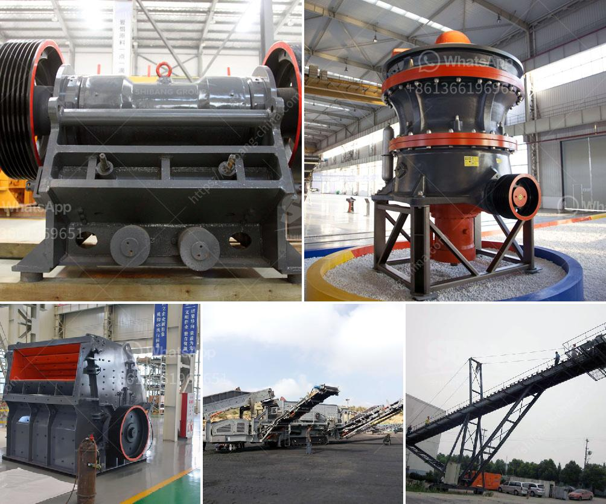

<h3>crusher plant price komatsu</h3>
When it comes to construction projects, having the right equipment is crucial in ensuring efficient and timely completion. One such equipment that plays a vital role is the crusher plant. A crusher plant is designed to break down large rocks into smaller pieces for further processing or for use in construction materials.

Komatsu, a renowned manufacturer and supplier of heavy construction machinery, offers a wide range of crusher plants to meet the diverse needs of customers worldwide. Their crusher plants are known for their durability, reliability, and efficiency, making them an ideal choice for various construction projects.

One of the key factors that set Komatsu crusher plants apart from the competition is their affordable prices. Komatsu understands the importance of keeping project costs in check, and they strive to provide cost-effective solutions without compromising on quality. Their range of crusher plants includes models suitable for small-scale projects as well as large-scale operations, allowing customers to choose the one that best suits their requirements and budget.

In addition to affordability, Komatsu crusher plants are also renowned for their superior performance. These plants are equipped with advanced technologies and features that enhance productivity and efficiency. Whether it's crushing hard rocks or processing recycled materials, Komatsu crusher plants offer exceptional performance, resulting in high-quality end products.

Furthermore, Komatsu takes pride in their commitment to customer satisfaction. Their team of experts is always ready to provide assistance and guidance to customers, ensuring smooth operation and maximum productivity of the crusher plants. Komatsu also offers comprehensive after-sales support, including maintenance services and spare parts availability, ensuring minimal downtime and uninterrupted operation.

In conclusion, when it comes to crusher plants, Komatsu is a trusted name in the construction industry. Their affordable prices, combined with exceptional performance and customer support, make their crusher plants a top choice for construction projects of any scale. If you're looking for a reliable and efficient solution for your crushing needs, consider Komatsu crusher plants for a cost-effective and hassle-free experience.
<h3>Contact us</h3><ul><li><strong>Whatsapp:&nbsp;<a href="https://wa.me/8613661969651">+8613661969651</a></strong></li><li><a href="https://swt.shibang-china.com/?git&amp;zhl&amp;crusher plant price komatsu"><strong>Online Service(chat now)</strong></a></li></ul><h3>Related</h3><ul><li><a href='double roller crusher advantages.md'>double roller crusher advantages</a></li><li><a href='portable concrete crusher rental maryland.md'>portable concrete crusher rental maryland</a></li><li><a href='crushing plant in maule.md'>crushing plant in maule</a></li><li><a href='how to machine limestone.md'>how to machine limestone</a></li><li><a href='setup for limestone crusher plant.md'>setup for limestone crusher plant</a></li></ul>