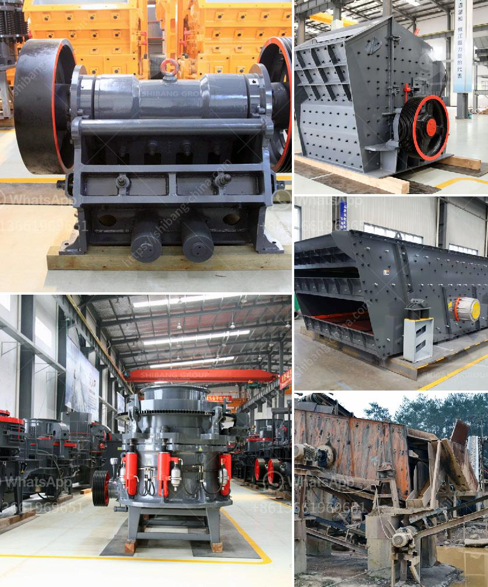

<h3>crusher price for crushed stone</h3>
Crushed stone is an essential material for constructing various infrastructures, such as roads, highways, buildings, bridges, and railways. It is a versatile and durable material that is commonly used in the construction industry. However, the price of crushed stone can vary depending on several factors. In this article, we will explore the factors that influence the price of crushed stone and provide some insights into the average price range.

One of the primary factors that determine the price of crushed stone is the type of stone. Different types of stones have varying properties, durability, and availability, which directly impact their price. For example, granite and limestone are commonly used stones for construction projects due to their strength and durability. These stones are usually priced higher compared to other stones, such as sandstone or gravel.

The size of the crushed stone also affects its price. Generally, smaller stones tend to be more expensive than larger ones. This is because smaller stones require more processing and screening, resulting in higher production costs. On the other hand, larger stones require less processing and are easier to handle and transport, which makes them more affordable.

Another significant factor that affects the price of crushed stone is the location and distance from the source. Quarries that are located closer to the construction site can offer lower prices since transportation costs are reduced. However, if the construction site is far from the quarry, the transportation costs can add up and increase the overall price of the crushed stone.

Moreover, the supply and demand dynamics of crushed stone can also impact its price. If there is a high demand for crushed stone but limited supply, the price is likely to be high. Conversely, if the supply exceeds the demand, the price may be lower. Factors such as seasonality and economic conditions can influence the demand for crushed stone, thereby affecting its price.

Additionally, the production and operational costs of the crushing equipment used to produce crushed stone also contribute to its price. The cost of purchasing and maintaining a crusher is a significant expense for any construction company. Therefore, the price of a crusher directly impacts the cost per tonne of crushed stone.

As the market leader in crushing equipment, Metso Outotec has designed and manufactured crushers for over 100 years. Their crushers have unbeatable performance and quality, ensuring high productivity and reduced downtime. Whether you need a primary, secondary, or tertiary crusher, Metso Outotec has a wide range of options to meet your specific requirements.

In conclusion, the price of crushed stone can vary depending on various factors, such as the type of stone, size, location, supply and demand, and the cost of crushing equipment. Considering these factors, it is recommended to do thorough research and compare prices from different suppliers to find the best value for your construction project. With reliable crushing equipment from Metso Outotec, you can achieve cost-effective and efficient production of crushed stone.
<h3>Contact us</h3><ul><li><strong>Whatsapp:&nbsp;<a href="https://wa.me/8613661969651">+8613661969651</a></strong></li><li><a href="https://swt.shibang-china.com/?git&amp;zhl&amp;crusher price for crushed stone"><strong>Online Service(chat now)</strong></a></li></ul><h3>Related</h3><ul><li><a href='7x8 foot ball mills.md'>7x8 foot ball mills</a></li><li><a href='mini rock mobile jaw crusher west africa price in uk.md'>mini rock mobile jaw crusher west africa price in uk</a></li><li><a href='different type of grinding mills.md'>different type of grinding mills</a></li><li><a href='price jaw crusher price stone crusher.md'>price jaw crusher price stone crusher</a></li><li><a href='hard rock quarry cursher in libya.md'>hard rock quarry cursher in libya</a></li></ul>