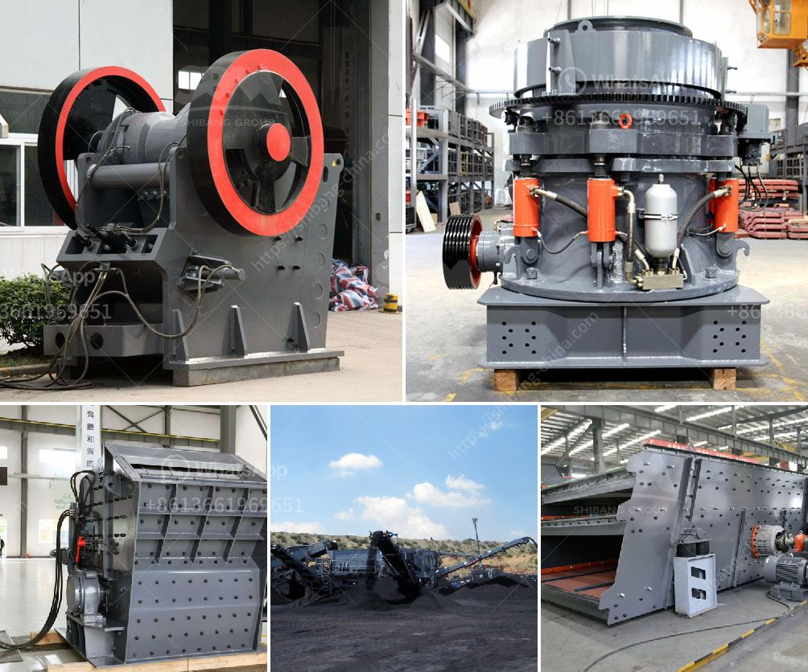

<h3>crusher rental companies in oman</h3>
Crusher rental companies in Oman have become an essential part of modern business operations. They provide a cost-effective alternative to owning machinery outright, which can be expensive and require significant capital investment. Crusher rental companies in Oman offer the potential for savings on transportation costs as well, since renting equipment allows the company to transport it to different sites as needed.

One of the most popular crusher rental companies in Oman is Quarry and Crushers in Oman. These crushers are known for their versatility and high productivity. The company offers a wide range of rental options, including crushers, screeners, shredders, and conveyors.

Renting crushers from Quarry and Crushers in Oman is an ideal option for companies that need crushing equipment for a short period of time. With flexible rental terms and competitive rates, customers can rent the machine that best suits their needs without making a long-term commitment.

Another crusher rental company in Oman is Al Hura Crushers Company LLC. Al Hura Crushers Company LLC has a fleet of modern machinery that is serviced by experienced mechanics and technicians. They offer a variety of crushers, screens, and washing equipment to meet the needs of different customers.

Renting from Al Hura Crushers Company LLC allows businesses to access top-quality machinery without having to worry about maintenance or repairs. The company takes care of all servicing and repairs, allowing customers to focus on their own operations.

Crusher rental companies in Oman also include Oriental Crusher LLC. Oriental Crusher LLC is well-known for its high-quality crushers to both the industrial and mining sectors. They provide crusher rental and sale services for businesses and individuals.

Oriental Crusher LLC understands the need for flexibility in today's fast-paced business world. That's why they offer crusher rental options with flexible terms and competitive rates. With a wide range of crushers available, customers can find the right machine for their specific needs.

One of the key advantages of renting crushers in Oman is that it reduces the upfront cost for businesses. Instead of investing a large amount of money outright, businesses can rent the necessary equipment at a fraction of the cost. This allows them to allocate their resources more effectively and invest in other important areas of their operations.

In addition to cost savings, renting crushers in Oman also allows businesses to remain flexible. They can adjust their rental agreements to suit their changing needs and scale their operations up or down accordingly. Whether a company needs crushers for a short-term project or long-term operations, renting offers the flexibility to meet those needs without making a significant ongoing commitment.

In conclusion, crusher rental companies in Oman are playing a vital role in the growth of the country's industrial sector. By providing cost-effective and flexible solutions, these companies are supporting the operations of various businesses and contributing to their success. With a range of crushers to choose from and competitive rates, renting offers a practical and efficient solution for businesses in need of crushing equipment.
<h3>Contact us</h3><ul><li><strong>Whatsapp:&nbsp;<a href="https://wa.me/8613661969651">+8613661969651</a></strong></li><li><a href="https://swt.shibang-china.com/?git&amp;zhl&amp;crusher rental companies in oman"><strong>Online Service(chat now)</strong></a></li></ul><h3>Related</h3><ul><li><a href='gypsum washing plant.md'>gypsum washing plant</a></li><li><a href='horizontal impact crusher for sale.md'>horizontal impact crusher for sale</a></li><li><a href='portable mobile stone crushing plants.md'>portable mobile stone crushing plants</a></li><li><a href='limestone powder conveying system.md'>limestone powder conveying system</a></li><li><a href='primary jaw crusher saudi.md'>primary jaw crusher saudi</a></li></ul>