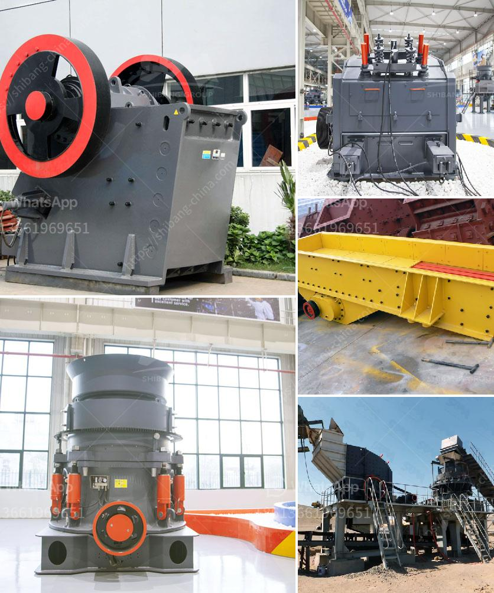

<h3>crusher sale philippines</h3>
The Philippines is often referred to as the "Pearl of the Orient Seas," and with its breathtaking landscapes and rich natural resources, it is no wonder why it has become a prime destination for tourists and investors alike. In recent years, one industry that has been steadily growing in the country is the crusher sale industry, which offers various types of crushers for sale to cater to different construction and mining needs.

The crusher sale industry in the Philippines primarily involves the sale of crushing equipment, such as jaw crushers, impact crushers, cone crushers, and portable crushing plants. These machines help crush raw materials into smaller and more manageable sizes, making them suitable for use in construction projects, mining operations, and other industries.

One of the key factors driving the growth of the crusher sale industry in the Philippines is the country's robust construction sector. The Philippines has been experiencing rapid urbanization and infrastructure development, leading to an increased demand for construction materials. Crushers play a crucial role in producing crushed stones, aggregates, and sand, which are essential in building roads, bridges, and buildings.

Furthermore, the mining industry in the Philippines also contributes to the growth of the crusher sale industry. The Philippines is rich in mineral resources, such as gold, copper, and nickel. To extract these valuable minerals, mining companies require crushers to break down large rocks into smaller fragments for processing. This creates a steady demand for crushers in the mining sector.

In response to the growing demand, crusher manufacturers and dealers in the Philippines have been ramping up their production and sales efforts. Both local and international companies have established a strong presence in the Philippine market, offering a wide range of crushers for sale. This increased competition has not only led to a wider selection of crushers available but has also driven prices down, making crushers more affordable for local buyers.

Moreover, the crusher sale industry in the Philippines is also benefiting from advancements in technology. Modern crushers are equipped with advanced features, such as computerized controls, hydraulic systems, and efficient engines that enhance their performance and productivity. These technological advancements allow crushers to operate more efficiently, reducing downtime and increasing overall productivity.

In conclusion, the crusher sale industry in the Philippines is experiencing steady growth as a result of the country's robust construction and mining sectors. The demand for crushers is expected to continue rising, with the need for construction materials and minerals extraction driving the market. With the presence of both local and international manufacturers, buyers in the Philippines are provided with a wide range of crushers to choose from at competitive prices. Additionally, technological advancements in crushers have improved their efficiency and productivity, further contributing to the growth of the industry. Overall, the crusher sale industry in the Philippines is poised to continue its upward trajectory, supporting the nation's economic development and infrastructure projects.
<h3>Contact us</h3><ul><li><strong>Whatsapp:&nbsp;<a href="https://wa.me/8613661969651">+8613661969651</a></strong></li><li><a href="https://swt.shibang-china.com/?git&amp;zhl&amp;crusher sale philippines"><strong>Online Service(chat now)</strong></a></li></ul><h3>Related</h3><ul><li><a href='sale ghana grinding crusher.md'>sale ghana grinding crusher</a></li><li><a href='calcium carbonate plant price.md'>calcium carbonate plant price</a></li><li><a href='crussher stone manufacturer in south africa.md'>crussher stone manufacturer in south africa</a></li><li><a href='mineral grinder navi mumbai.md'>mineral grinder navi mumbai</a></li><li><a href='limestone crushing plant manufacturer.md'>limestone crushing plant manufacturer</a></li></ul>