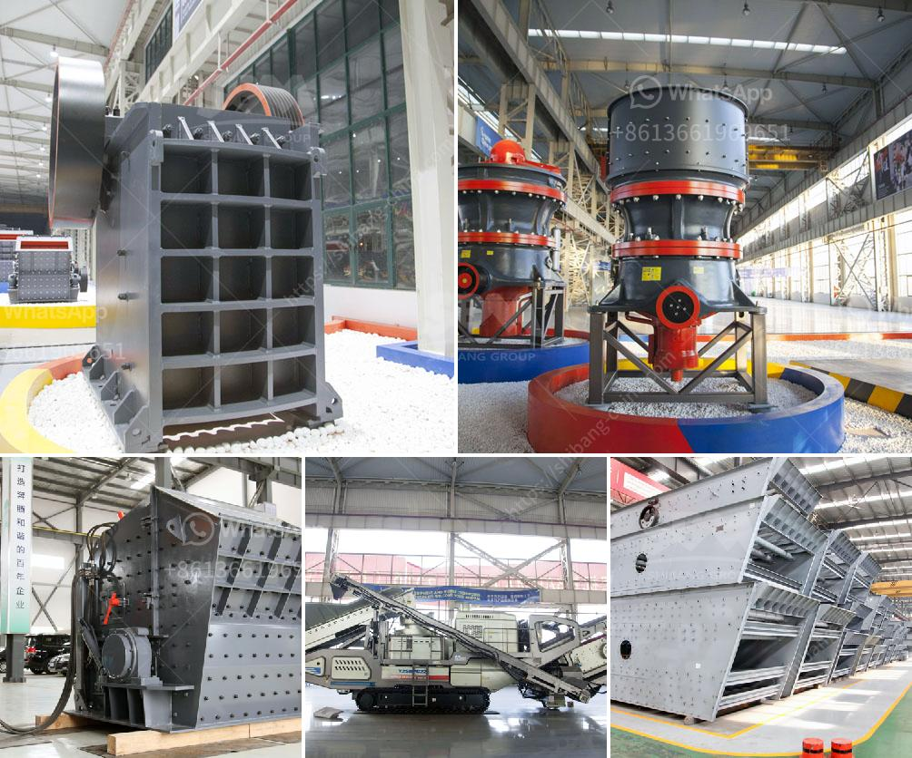

<h3>crusher sand and stone in kenya</h3>
Crusher sand and stone are some of the key materials used in construction and landscaping projects in Kenya. Like any other design component, these elements have a significant impact on the final look and functionality of a project. Understanding the properties of crusher sand and stone can help make informed decisions when planning for a construction or landscaping project in Kenya.

Crusher sand, also known as manufactured sand, is a type of artificial sand that is used specifically for construction purposes. It is produced by crushing rocks, quarry stones, or larger aggregate pieces into sand-sized particles. The sharp edges and irregular shapes of the crushed stones help to provide better interlocking and stability when used in concrete or paving applications. The fine texture of crusher sand also enhances workability, making it easier to mix and compact with other materials.

One major advantage of using crusher sand in construction is its consistent quality. Unlike natural sand, which may contain impurities or vary in composition, crusher sand can be manufactured to meet specific requirements, such as grading and particle size distribution. This consistency ensures that the sand performs predictably and delivers the desired strength and durability in the finished product.

Stone, on the other hand, refers to natural rocks or quarry stones that are used in construction and landscaping. The term "stone" typically encompasses a variety of materials, including crushed stone, gravel, and decorative stones. Stones can be categorized based on size, shape, and origin, each serving different functions in construction and landscaping.

Crushed stone is often used as a base material for roads, driveways, and walkways. It provides a stable foundation and helps to prevent the erosion of underlying soil. Different sizes of crushed stone can be used for different applications, with smaller stones typically used for leveling and larger stones used for drainage. Gravel, also a type of crushed stone, is commonly used in landscaping projects to create pathways, driveways, or to fill gaps between pavers.

Decorative stones, like river rocks, pebbles, or flagstones, are prized for their aesthetic appeal. They can enhance the overall look of a garden, create unique focal points, or add texture and color to outdoor spaces. In addition to being visually pleasing, decorative stones can also serve functional purposes, such as preventing soil erosion or providing natural drainage.

When using crusher sand and stone in construction or landscaping projects, it is important to source these materials from reputable suppliers who follow sustainable practices. Quarrying activities can have environmental impacts, such as deforestation, habitat destruction, and soil erosion. Therefore, opting for suppliers who adhere to responsible quarrying practices can help minimize these negative impacts.

In conclusion, crusher sand and stone are essential components of construction and landscaping projects in Kenya. Their consistent quality, durability, and versatility make them popular choices for various applications. As with any construction material, it is crucial to source crusher sand and stone from reputable suppliers to ensure their quality and minimize environmental impacts.
<h3>Contact us</h3><ul><li><strong>Whatsapp:&nbsp;<a href="https://wa.me/8613661969651">+8613661969651</a></strong></li><li><a href="https://swt.shibang-china.com/?git&amp;zhl&amp;crusher sand and stone in kenya"><strong>Online Service(chat now)</strong></a></li></ul><h3>Related</h3><ul><li><a href='stone crusher cameroon.md'>stone crusher cameroon</a></li><li><a href='tons per hour mobile crushers.md'>tons per hour mobile crushers</a></li><li><a href='stone crusher machine tutorials.md'>stone crusher machine tutorials</a></li><li><a href='crushing and screening market in india.md'>crushing and screening market in india</a></li><li><a href='price of ballast crusher per ton in kenya.md'>price of ballast crusher per ton in kenya</a></li></ul>