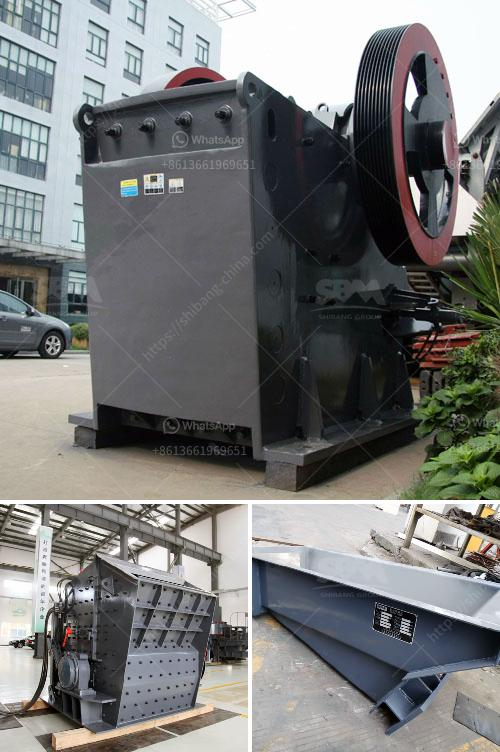

<h3>crusher stone machine price</h3>
Crushing stones or rocks is prevalent in many industries including mining, construction, and landscaping. The material is often used as aggregates in construction projects, such as roads, highways, bridges, buildings, and more. To efficiently carry out this task, crusher machines are used. As market demands for these machines are increasing, it's crucial to understand the factors that can affect their prices.

One major factor affecting crusher stone machine price is quality. High-quality machines tend to be more expensive due to the use of robust materials, advanced technology, and stringent manufacturing processes. These machines are designed to withstand heavy-duty operations and offer greater reliability, durability, and longevity.

Another aspect impacting the price is the brand reputation. Well-established brands known for their superior products usually charge a premium for their crusher machines. This is because customers trust these brands and are willing to pay extra for the assurance of quality and reliability.

Additionally, the type and size of the crusher machine can influence its price. There are various types available, such as jaw crushers, impact crushers, cone crushers, and more. Each type caters to different crushing needs and has its own set of features. The size of the machine also plays a role in its price, as larger machines are generally more expensive due to higher production capacities.

Moreover, market demand and competition can impact prices. If the demand for crusher stone machines is high, prices may tend to be higher. Conversely, when the market becomes saturated or competitive, prices may become more competitive as manufacturers strive to attract customers.

When considering the price of a crusher stone machine, it's important to evaluate the value it provides in terms of performance, efficiency, and durability. While investing in high-quality machines may require a higher upfront cost, they often lead to long-term cost savings due to reduced maintenance, repairs, and downtime.

In conclusion, the price of a crusher stone machine is influenced by several factors, including quality, brand reputation, type, size, market demand, and competition. When making a purchase decision, it's essential to carefully assess these factors to ensure the machine meets your specific requirements and offers a favorable return on investment.
<h3>Contact us</h3><ul><li><strong>Whatsapp:&nbsp;<a href="https://wa.me/8613661969651">+8613661969651</a></strong></li><li><a href="https://swt.shibang-china.com/?git&amp;zhl&amp;crusher stone machine price"><strong>Online Service(chat now)</strong></a></li></ul><h3>Related</h3><ul><li><a href='chrome processing manufacturers india.md'>chrome processing manufacturers india</a></li><li><a href='equipment costs for cement plant.md'>equipment costs for cement plant</a></li><li><a href='stone crushers hire scotland.md'>stone crushers hire scotland</a></li><li><a href='price of roller crushers in usa.md'>price of roller crushers in usa</a></li><li><a href='three roll milling italy.md'>three roll milling italy</a></li></ul>