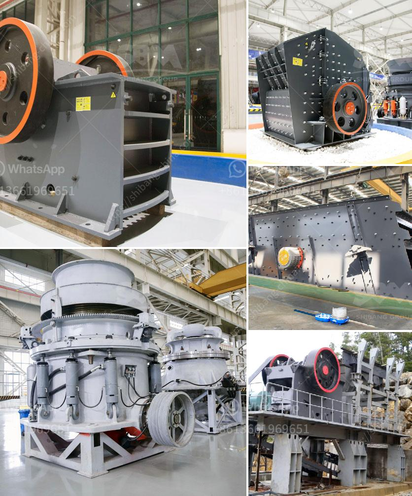

<h3>crusher stone peru</h3>
Crusher stone, also known as crushed stone or aggregate, is a versatile building material that has been used for centuries in various construction projects around the world. Peru, a country known for its rich natural resources, is home to abundant sources of crusher stone. In this article, we will explore the characteristics and uses of crusher stone in Peru.

One of the primary reasons crusher stone is widely used in construction is its durability. It is made by crushing large rocks into smaller fragments, resulting in a material that is resistant to erosion and weathering. This makes it ideal for outdoor applications such as road construction, driveways, and pathways. Crusher stone is often used as a base material for the construction of roads, ensuring stability and longevity.

In Peru, where the terrain can be challenging, crusher stone is particularly valuable for creating stable foundations. Its compactness and ability to interlock provide a solid base that can withstand heavy loads and prevent shifting or settling. This is especially important in areas prone to earthquakes or landslides. The versatility of crusher stone allows for its use in a wide range of construction projects, from small residential developments to large-scale infrastructure.

Apart from its structural benefits, crusher stone also offers aesthetic advantages. It comes in various sizes and colors, allowing for customization in different applications. In Peru, where architecture and urban design often celebrate the country's rich cultural heritage, crusher stone can be used to create visually appealing structures that blend seamlessly with the surrounding landscape. Whether it is used to construct retaining walls or decorative elements, crusher stone adds a touch of elegance to any project.

Another significant advantage of crusher stone is its affordability. Compared to other building materials, such as concrete or asphalt, crusher stone is relatively inexpensive. This makes it an attractive option for developers and homeowners looking to stick within their budgets without compromising on quality. By choosing crusher stone, construction projects in Peru can save costs while still achieving long-lasting and visually appealing results.

In recent years, Peru has experienced a growth in infrastructure development, with an increasing demand for reliable and sustainable construction materials. Crusher stone has played a vital role in meeting this demand, providing a readily available and durable option for builders and engineers. Its versatility has allowed it to be used in a wide range of projects, from roadways and bridges to residential and commercial buildings.

In conclusion, crusher stone is a versatile building material with numerous advantages for construction projects in Peru. Its durability, versatility, affordability, and aesthetic appeal make it a popular choice among builders and homeowners alike. With its ability to withstand heavy loads and resistance to erosion, crusher stone ensures the long-term stability of structures. As Peru continues to invest in its infrastructure, crusher stone will remain a crucial component in the country's construction industry.
<h3>Contact us</h3><ul><li><strong>Whatsapp:&nbsp;<a href="https://wa.me/8613661969651">+8613661969651</a></strong></li><li><a href="https://swt.shibang-china.com/?git&amp;zhl&amp;crusher stone peru"><strong>Online Service(chat now)</strong></a></li></ul><h3>Related</h3><ul><li><a href='rock crusher distributors in phillipinwes.md'>rock crusher distributors in phillipinwes</a></li><li><a href='component and processes of cement.md'>component and processes of cement</a></li><li><a href='price of artificial sand mill.md'>price of artificial sand mill</a></li><li><a href='rotary hammer mills with dispenser.md'>rotary hammer mills with dispenser</a></li><li><a href='manufacturing process of mica crusher.md'>manufacturing process of mica crusher</a></li></ul>