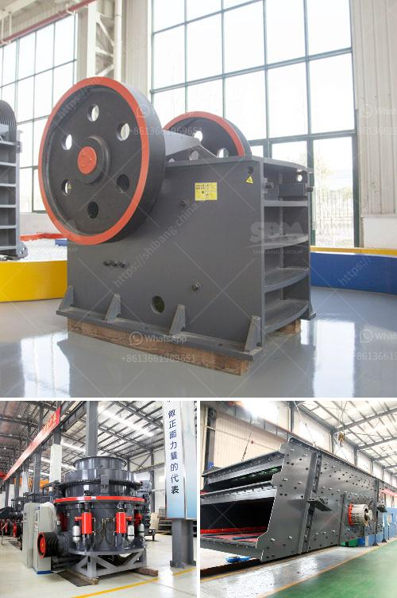

<h3>crushers and grinders mill</h3>
Crushers and grinders are essential tools in the mining industry and are commonly used to break down larger rocks and minerals into more manageable pieces. They are typically used for crushing and grinding stones and other materials to extract valuable minerals or other substances.

Crushers are machines designed to break larger rocks into smaller, more manageable sizes. They come in various forms, such as jaw crushers, gyratory crushers, cone crushers, and impact crushers. Jaw crushers are most commonly used for primary crushing, where a smaller size is required for further processing. Gyratory crushers are often utilized for secondary crushing, while cone crushers are commonly used for tertiary or fine crushing.

On the other hand, grinders are machines that are used to grind and pulverize materials into fine particles. They are commonly used in various industries such as mining, pharmaceuticals, and food processing. Ball mills, rod mills, and SAG mills are commonly used types of grinders in the mining industry.

Crushing and grinding processes are vital in extracting valuable minerals and metals from the ore. The grinding process reduces the ore to a finer size, allowing the minerals to be freed from the surrounding rock. This is achieved by using a combination of crushing equipment, grinding mills, and classifiers.

In addition to mining applications, crushers and grinders are also used in other industries such as construction, agriculture, and recycling. They can be utilized for various purposes, including processing construction debris, grinding wood waste, and crushing recyclables.

In summary, crushers and grinders play a crucial role in the mining industry and various other sectors by breaking down larger rocks and materials into smaller, more manageable sizes. They are essential tools in the extraction of valuable minerals and substances. With advancements in technology, crushers and grinders continue to evolve, offering improved efficiency, productivity, and safety in their operations.
<h3>Contact us</h3><ul><li><strong>Whatsapp:&nbsp;<a href="https://wa.me/8613661969651">+8613661969651</a></strong></li><li><a href="https://swt.shibang-china.com/?git&amp;zhl&amp;crushers and grinders mill"><strong>Online Service(chat now)</strong></a></li></ul><h3>Related</h3><ul><li><a href='aggregate production line.md'>aggregate production line</a></li><li><a href='calcium carbonate mining manufacturer in malaysia.md'>calcium carbonate mining manufacturer in malaysia</a></li><li><a href='crusher machine to make fine powder.md'>crusher machine to make fine powder</a></li><li><a href='gold mining mercury.md'>gold mining mercury</a></li><li><a href='river sand and stone mining at sabah.md'>river sand and stone mining at sabah</a></li></ul>