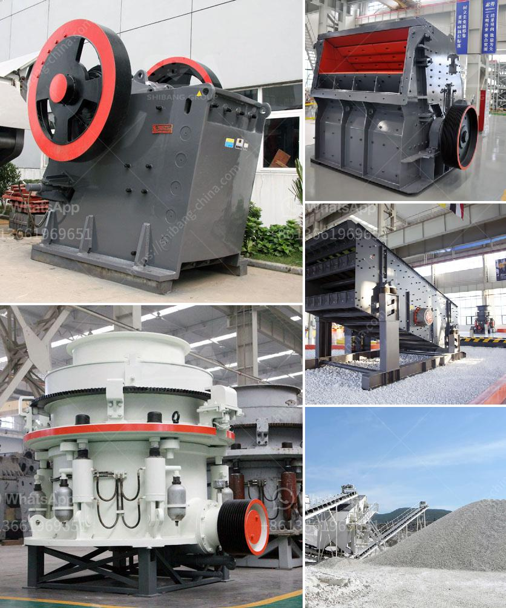

<h3>crushers equipment dealer in saudi arabia</h3>
Saudi Arabia is the largest construction market in the Middle East region, with a vast development project underway that promises a bright future for the local industry. Crusher equipment dealer in Saudi Arabia has formed a strategic partnership with renowned crushing and screening manufacturers around the world, enabling them to offer comprehensive solutions to customers in the construction, mining, quarrying, and recycling industries.

The tremendous growth of the construction industry in Saudi Arabia has led to the increasingly high demand for crushing and screening equipment. Crusher equipment dealer in Saudi Arabia is a global leader in the construction industry with a vast supply of crushing equipment that is suitable for any size of project.

Businesses in the construction industry rely on crushers to process raw materials into a usable construction material, making it the perfect option for their next project. Crushers Equipment Dealer in Saudi Arabia simplifies the construction process by reducing the size of raw materials such as limestone or sandstone to a suitable size that is ready for use in the construction industry.

Purchasing crushers equipment from a dealer in Saudi Arabia can provide a potential buyer with a wide range of options to choose from. The dealer collaborates with reputable manufacturers, enabling the buyer to compare between different models and make the best decision.

Crushing equipment is a vital part of mining operations since it can break down large material into manageable pieces. Earth movers play an important role in the mining industry because the equipment is specifically designed to work on large earth-moving and mining projects for a faster and more practical process. Crushing equipment dealers in Saudi Arabia ensure that the equipment they sell meets all safety requirements and users have support when they need it.

The crushing equipment holds significant importance in the construction industry. Saudi Arabia has numerous construction projects underway and the Crushing equipment dealer in Saudi Arabia will guarantee expanded capabilities, increased efficiency, and expedited completion of these projects.

The demand for crushing and screening equipment in Saudi Arabia is very high, driven by the mining and construction industries. They are in need of high-quality aggregate materials. Crushers equipment dealer in Saudi Arabia offers a variety of options in different sizes to meet customer requirements.

Crusher equipment dealers in Saudi Arabia are thriving due to the demand for crushers/ crushing equipment from local and international businesses. These crushers are a vital piece of equipment for mining and quarry operations, as they reduce the size of the extracted material, making it easier for further processing.

Crushing and screening equipment generally consists of departmental crushers capable of handling larger fragments while more delicate screening equipment is used for smaller fragments. Saudi Arabia has created a sustainable construction industry by investing in advanced technology and innovation and by adopting environmentally friendly solutions.

Crushers equipment dealer in Saudi Arabia has helped construction firms throughout the kingdom execute their projects on time and with efficiency. They are a trusted source of construction equipment that can enhance the quality of work on any construction project. They provide crushers that are a crucial part of many industrial and materials processing projects, helping their customers achieve the highest return on investment possible and improve the overall efficiency of their operations.
<h3>Contact us</h3><ul><li><strong>Whatsapp:&nbsp;<a href="https://wa.me/8613661969651">+8613661969651</a></strong></li><li><a href="https://swt.shibang-china.com/?git&amp;zhl&amp;crushers equipment dealer in saudi arabia"><strong>Online Service(chat now)</strong></a></li></ul><h3>Related</h3><ul><li><a href='rotary kiln cement plant cost in india.md'>rotary kiln cement plant cost in india</a></li><li><a href='kenya quarry crusher.md'>kenya quarry crusher</a></li><li><a href='crusher plant in malaysia.md'>crusher plant in malaysia</a></li><li><a href='grinding mill prices in harare.md'>grinding mill prices in harare</a></li><li><a href='precipitated calcium carbonate production plant design.md'>precipitated calcium carbonate production plant design</a></li></ul>