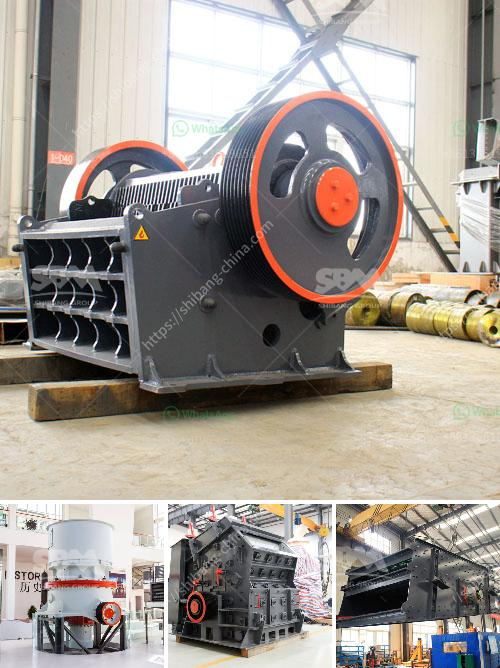

<h3>crushers for aggregate production</h3>
Crushers are essential machines used in the crushing process of aggregate materials. They play a significant role in reducing the size of rocks and stones, ensuring that they are suitable for use in construction projects. There are different types of crushers available in the market, each with its unique features and capabilities, making them versatile tools for aggregate production.

One common type of crusher used for aggregate production is the jaw crusher. This primary crusher operates by the action of a compressive force, breaking rocks into smaller sizes. It is commonly used for mining and quarrying, where larger rocks need to be reduced into smaller particles for further processing. Its sturdy construction and high efficiency make it ideal for handling a wide range of materials.

Another popular crusher option for aggregate production is the cone crusher. This secondary crusher operates by squeezing material between an eccentrically gyrating spindle and a fixed concave or mantle. It is commonly used for secondary and tertiary crushing to produce a finely crushed, well-shaped end product. The cone crusher's ability to crush hard, abrasive rocks and ores efficiently makes it a suitable choice for aggregate production.

Impact crushers are also widely used in aggregate production. They operate by using high-speed collisions between the particles and the breaker plates in the machine. These crushers are typically used for medium to hard rocks, producing aggregates with a good cubic shape. They are suitable for a variety of applications, including concrete production and asphalt paving.

Crushers for aggregate production are vital tools that provide the necessary raw materials for construction projects. From building foundations to road construction, crushers play a pivotal role in ensuring the quality and durability of the final product. They help convert large rocks into smaller, more manageable sizes, which can then be used for various purposes.

In conclusion, crushers are essential machines for aggregate production in the construction industry. Their ability to break down rocks and stones into smaller sizes ensures the availability of suitable materials for various construction projects. With different types of crushers available, each with its own advantages, the construction industry can rely on these machines to obtain high-quality aggregates efficiently.
<h3>Contact us</h3><ul><li><strong>Whatsapp:&nbsp;<a href="https://wa.me/8613661969651">+8613661969651</a></strong></li><li><a href="https://swt.shibang-china.com/?git&amp;zhl&amp;crushers for aggregate production"><strong>Online Service(chat now)</strong></a></li></ul><h3>Related</h3><ul><li><a href='crusher manufacturers in russia.md'>crusher manufacturers in russia</a></li><li><a href='small scale marble crushing and processing industery.md'>small scale marble crushing and processing industery</a></li><li><a href='set up stone crusher plant.md'>set up stone crusher plant</a></li><li><a href='gold wash plant machine in ghana.md'>gold wash plant machine in ghana</a></li><li><a href='used triple horizontal vibrating screen for sale.md'>used triple horizontal vibrating screen for sale</a></li></ul>