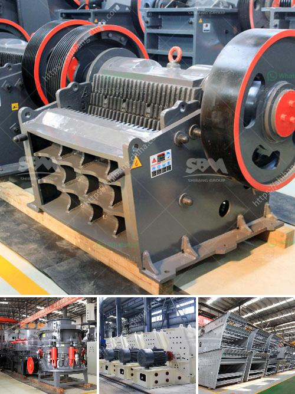

<h3>crushers for sale in uae</h3>
In recent years, the UAE’s construction industry has been growing at a steady pace. With the increase in infrastructure projects and urban development, there is a high demand for construction machinery, including crushers.

Crushers are machines designed to break large rocks into smaller rocks, gravel, or rock dust. They are widely used in many sectors such as mining, quarrying, and demolition where crushers are essential equipment. Crushers are also commonly used in the construction industry, as concrete and asphalt material can be crushed and recycled for future use.

The UAE is known for its bustling construction and real estate sector. With numerous ongoing projects and new ones in the pipeline, the demand for crushers has never been higher. Whether it is for commercial purposes or personal use, there are various types of crushers available for sale in the UAE.

One of the most popular types of crushers is a jaw crusher. This machine works by compressing materials, such as granite, into smaller pieces. The jaw crusher has a fixed jaw plate and a moving jaw plate. When the feed material enters the crushing chamber, it gets crushed by the two jaw plates.

Another commonly used crusher is the impact crusher. Unlike the jaw crusher, the impact crusher uses impact to crush the materials. The impact crusher is ideal for crushing materials with low abrasiveness and high resistance to compression.

Cone crushers are also widely used in the UAE as they help crush materials in an efficient manner. The cone crusher makes use of both a fixed and movable cone to grind ore and rock into small pieces. Pre-crushed product is fed vertically through the top of the cone crusher and, once crushed between the cones, the ground materials are discharged through the discharge hole.

When looking for crushers for sale in the UAE, one should consider several factors, such as the location, quality, and price of the machinery. Additionally, while buying a used crusher, make sure to get a detailed inspection report and a warranty to ensure the crusher is in good working condition and not prone to breakdown.

There are many reputable suppliers and dealers in the UAE that offer a wide range of high-quality crushers for sale. These suppliers cater to various budgets and offer crushers of different sizes and capacities. They also provide after-sales services such as installation, maintenance, and spare parts to ensure the longevity and optimal performance of the crushers.

Furthermore, crushers for sale in the UAE can be found at competitive prices compared to international markets. This is due to factors such as lower transportation costs and the availability of locally manufactured crushers.

In conclusion, crushers are essential equipment in the UAE construction industry, particularly for the crushing and recycling of various materials. There are several types of crushers available in the market, including jaw, impact, and cone crushers. When choosing a crusher, one should consider factors such as location, quality, and price. Reputable suppliers in the UAE offer a wide range of crushers for sale, catering to different budgets and providing after-sales services. With the UAE’s growing construction industry, investing in a crusher proves to be a wise choice.
<h3>Contact us</h3><ul><li><strong>Whatsapp:&nbsp;<a href="https://wa.me/8613661969651">+8613661969651</a></strong></li><li><a href="https://swt.shibang-china.com/?git&amp;zhl&amp;crushers for sale in uae"><strong>Online Service(chat now)</strong></a></li></ul><h3>Related</h3><ul><li><a href='equipment design of coal washing plant.md'>equipment design of coal washing plant</a></li><li><a href='custom milling for small scale mining.md'>custom milling for small scale mining</a></li><li><a href='pulverizer crusher manufacturer in pune.md'>pulverizer crusher manufacturer in pune</a></li><li><a href='cost of crushed concrete.md'>cost of crushed concrete</a></li><li><a href='crushing plant for sale in tanzania.md'>crushing plant for sale in tanzania</a></li></ul>