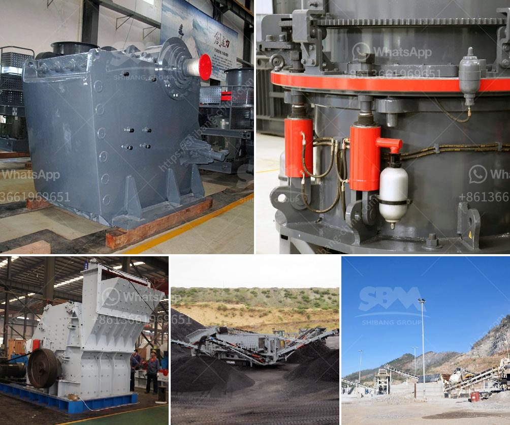

<h3>crushers for sale in</h3>
When considering crushers for sale, it is important to understand the underlying factors that contribute to the value of crushing equipment. These machines are primarily used for reducing the size of waste materials, including stone, concrete, asphalt, and demolition rubble, as well as the processing of recycled materials. The increasing demand for recycled materials, coupled with advancements in technology and regulations, make crushers an essential component in various industries.

The primary purpose of crushers is to break down large sized rocks or stones into smaller pieces for further processing. This not only reduces the size of the waste material, but also separates valuable minerals from the undesired ones, enabling efficient recycling and reuse. Additionally, crushers have the ability to crush different types of materials, making them versatile and cost-effective machines for numerous applications.

There are various types of crushers available for sale, each with its own unique features and advantages. Jaw crushers, for example, are ideal for primary crushing applications. They are designed to handle large feed sizes and are usually used for the first stage of crushing. Cone crushers, on the other hand, are more commonly used for secondary or tertiary crushing. These machines have a smaller feed size and are capable of producing finer output.

Another important consideration when choosing a crusher for sale is the size of the desired end product. Crushers are available in different configurations, each with its own specific crushing ratio, which determines the size of the final product. Selecting the appropriate crushing ratio ensures that the desired end product is achieved efficiently. For instance, if a finer output is required, a cone crusher with a higher crushing ratio would be preferred.

Furthermore, crushers for sale come with various additional features that make them more efficient and user-friendly. These include automation systems, hydraulic controls, and overload protection, which help to optimize the performance of the machine and safeguard against any potential damage.

Environmental regulations have also played a significant role in driving the demand for crushers for sale. With growing concerns about the impact of waste materials on the environment, recycling has become a crucial aspect of waste management. Crushers play a vital role in this process by reducing the volume of waste, thereby promoting responsible disposal and reducing carbon emissions.

In conclusion, crushers for sale are essential machines used in various industries for recycling and processing waste materials. From reducing large rocks to producing fine aggregates, crushers are versatile tools that unlock the value in waste. As the demand for recycled materials continues to grow and environmental regulations become stricter, crushers are becoming indispensable in waste management and sustainable development. By investing in high-quality crushers, businesses can not only reduce their environmental footprint but also benefit from cost savings and increased productivity.
<h3>Contact us</h3><ul><li><strong>Whatsapp:&nbsp;<a href="https://wa.me/8613661969651">+8613661969651</a></strong></li><li><a href="https://swt.shibang-china.com/?git&amp;zhl&amp;crushers for sale in"><strong>Online Service(chat now)</strong></a></li></ul><h3>Related</h3><ul><li><a href='copper processing plants in usa for sale.md'>copper processing plants in usa for sale</a></li><li><a href='portable coal crusher.md'>portable coal crusher</a></li><li><a href='slag crusher machine india.md'>slag crusher machine india</a></li><li><a href='consumption of ball mill with roller.md'>consumption of ball mill with roller</a></li><li><a href='roller mill sizes.md'>roller mill sizes</a></li></ul>