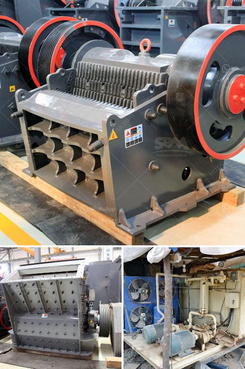

<h3>crushers i want to build a crusher</h3>
In the realm of engineering and industrial applications, crushers play a significant role in breaking down larger rocks, minerals, and other materials into smaller, more manageable pieces. With their ability to process materials quickly and efficiently, crushers have become a vital tool in various industries, including mining, construction, and recycling.

When it comes to choosing the right crusher for your specific project or operation, several factors need to be considered, such as the material type, size, and desired end product. Each crusher is uniquely designed to accommodate different needs and to ensure that the desired output is achieved.

The primary function of a crusher is to reduce the size of a material for easier handling or subsequent processing. Different types of crushers excel at accomplishing this task in diverse ways. For example, jaw crushers are commonly used for primary crushing, where larger rocks are initially broken down into smaller, more manageable pieces. Cone crushers, on the other hand, are often used for secondary or tertiary crushing, handling finer materials and producing even smaller particle sizes.

Efficiency is a key element in crusher design. The ability to swiftly process large quantities of material ensures productivity and cost-effectiveness. Crushers with advanced technology and features can greatly enhance this efficiency, allowing for faster and smoother operations. Many modern crushers are equipped with hydraulic systems, automated controls, and variable speed drives to optimize performance and maintain a consistent output.

In recent years, sustainability and environmental concerns have driven the development of crushers suited for recycling applications. These crushers are designed to effectively process waste materials and recycled products, minimizing waste and increasing the reusability of valuable resources. By crushing and recycling materials on site, industries can reduce their impact on the environment while also benefiting economically.

When considering building a crusher, it is crucial to thoroughly analyze your specific requirements, consult with experts, and choose a suitable type of crusher for your project. Whether you are crushing stone, ore, concrete, or other materials, investing in a high-quality crusher will ensure optimal productivity, efficiency, and cost savings in the long run.

To conclude, crushers are an essential tool in various industries, facilitating the reduction of materials into smaller, more manageable sizes. Their ability to efficiently process large quantities of material contributes to increased productivity, reduced costs, and improved sustainability. When planning to build a crusher, it is crucial to carefully consider your requirements, consult with experts, and select the right type of crusher for your project's needs. With the right crusher at your disposal, you can achieve efficient material processing and make notable progress towards your desired goals.
<h3>Contact us</h3><ul><li><strong>Whatsapp:&nbsp;<a href="https://wa.me/8613661969651">+8613661969651</a></strong></li><li><a href="https://swt.shibang-china.com/?git&amp;zhl&amp;crushers i want to build a crusher"><strong>Online Service(chat now)</strong></a></li></ul><h3>Related</h3><ul><li><a href='vibrating screen specification pdf.md'>vibrating screen specification pdf</a></li><li><a href='chili grinding milling.md'>chili grinding milling</a></li><li><a href='bauxite crusher machine.md'>bauxite crusher machine</a></li><li><a href='mineral industrial crushers.md'>mineral industrial crushers</a></li><li><a href='crushing and grinding.md'>crushing and grinding</a></li></ul>