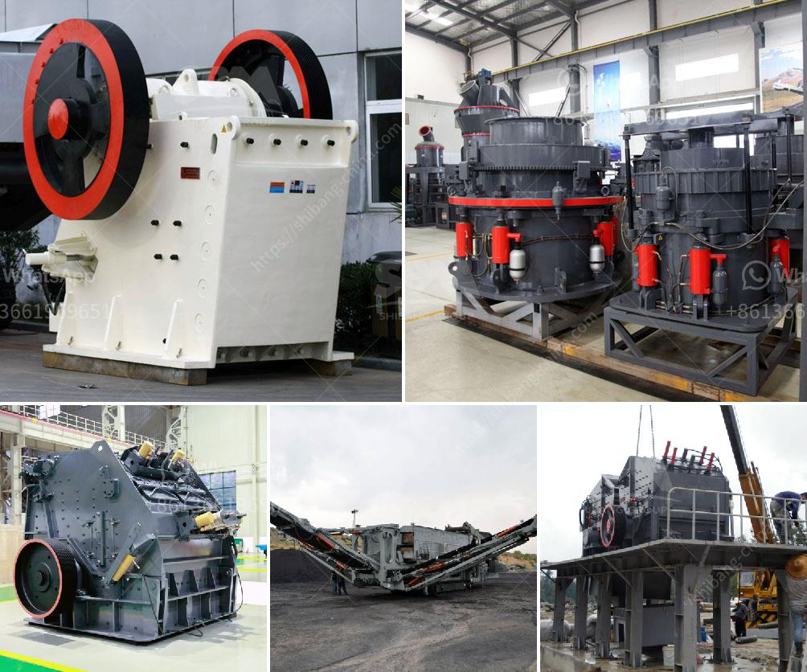

<h3>crushers of jaw china</h3>
In the realm of crushing equipment, the jaw crusher reigns supreme. With its simple structure, powerful crushing capability, and easy maintenance, it has become the preferred choice for a wide range of applications. In China, the production of jaw crushers is booming, especially with the continuous expansion of infrastructure projects.

A jaw crusher is essentially a machine that uses compressive force to break down solid materials such as rocks, ores, and construction waste into smaller pieces. It consists of two jaws, one fixed and one moving, which are mounted on a pitman. The movable jaw reciprocates back and forth against the fixed jaw, squeezing the material, thereby crushing it.

China's jaw crushers are renowned for their high efficiency and low operating costs. Not only are they widely used in mining, quarrying, and construction industries, but they are also ideal for recycling asphalt and concrete wastes. These crushers have become the go-to machines for processing materials, thanks to their excellent performance and robust construction.

One of the main advantages of jaw crushers in China is their versatility. They can handle a wide range of materials, from soft to medium-hard rocks. Whether it is limestone, granite, basalt, or even concrete, these crushers can effortlessly reduce them to the desired size. This adaptability makes jaw crushers indispensable in various industries.

China's jaw crusher manufacturers are constantly making improvements in their design to ensure maximum performance and reliability. One notable feature of jaw crushers is their ability to crush materials of various sizes. From large boulders to small pebbles, a jaw crusher can process them all, making it a reliable choice for many crushing operations.

Furthermore, China's jaw crushers are equipped with advanced technologies that enhance their efficiency. These include hydraulic systems that allow for easy adjustment of the jaw opening and closed side setting. This feature enables operators to achieve the desired product size quickly and without any hassle. Additionally, the overload protection system prevents damage to the crusher in case of an excessive load.

Maintenance is another area where China's jaw crushers excel. With their straightforward design, these machines are easy to inspect and repair. They come with replaceable wear parts, such as jaw plates and toggle plates, which can be easily replaced when worn out. Regular maintenance and timely replacement of these parts ensure that the jaw crusher operates at its peak performance for extended periods.

In conclusion, China's jaw crushers have proven to be powerhouses when it comes to crushing. Their versatility, efficient performance, and reliable operation make them the preferred choice for various industries. Their ability to handle a wide range of materials and their ease of maintenance further solidify their position in the crushing equipment market. As infrastructure projects continue to multiply in China, the demand for jaw crushers is set to rise, making them an indispensable asset for any crushing operation.
<h3>Contact us</h3><ul><li><strong>Whatsapp:&nbsp;<a href="https://wa.me/8613661969651">+8613661969651</a></strong></li><li><a href="https://swt.shibang-china.com/?git&amp;zhl&amp;crushers of jaw china"><strong>Online Service(chat now)</strong></a></li></ul><h3>Related</h3><ul><li><a href='limestone powder conveying system.md'>limestone powder conveying system</a></li><li><a href='mobile crusher plant for hire in province.md'>mobile crusher plant for hire in province</a></li><li><a href='diesel engine stone crusher small for quarry project.md'>diesel engine stone crusher small for quarry project</a></li><li><a href='stone cracher mechine manufacturer.md'>stone cracher mechine manufacturer</a></li><li><a href='portal gold mining machine.md'>portal gold mining machine</a></li></ul>