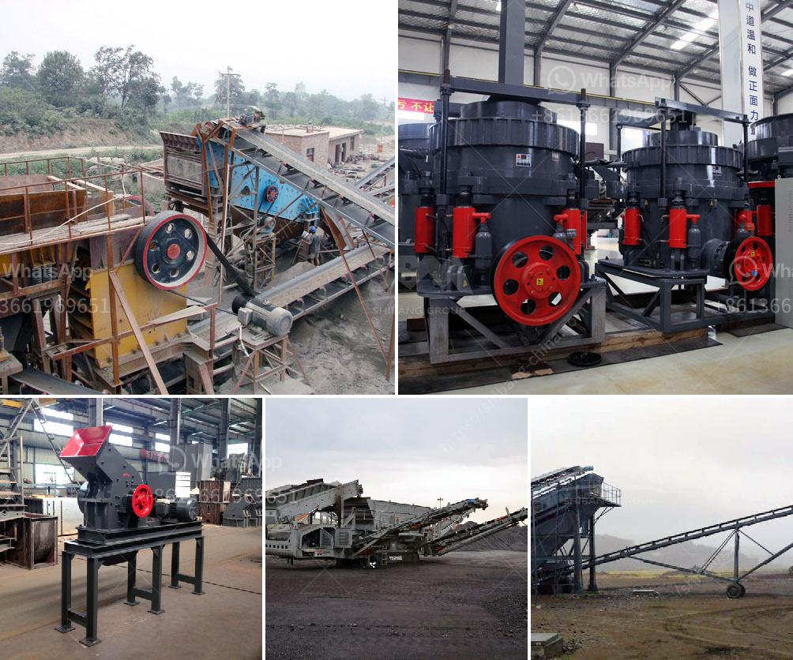

<h3>crushers rock crushers and minerals</h3>
Crushers and rock crushers are commonly utilized in mineral processing and mining industries to reduce the size of ore blocks or rock masses. These machines are able to break down larger rocks into smaller pieces, making them easier to transport, process, and use. In this article, we will delve into the world of crushers, the different types available, and the role they play in mineral enrichment processes.

Crushers are mechanical devices that apply pressure and force to break apart materials such as rocks, ores, and minerals. Their primary function is to reduce the size of these materials to a manageable level, often resulting in a final product suitable for further processing or use. Crushers come in different shapes, sizes, and configurations, each designed to cater to specific crushing needs.

One of the most commonly used types of crushers is the jaw crusher. Jaw crushers have a stationary jaw and a moving jaw, which compresses and breaks down the incoming material. These crushers are ideal for primary crushing applications, as they can handle larger rock or ore sizes. They are also often used in recycling processes, such as concrete and asphalt recycling.

Another popular type of crusher is the cone crusher. Cone crushers have a conical-shaped crushing head that rotates eccentrically within a crushing chamber. The material is progressively crushed and falls out through the bottom. Cone crushers are often used in secondary and tertiary crushing stages, as they can produce finer particles compared to jaw crushers.

Impact crushers, as the name suggests, utilize impact forces to break apart the material. These crushers contain hammers or blow bars that strike and shatter the incoming rocks or minerals. Impact crushers are commonly used in quarries, mining operations, and recycling applications. They are particularly effective in crushing softer materials like limestone and gypsum.

Additionally, there are specialized crushers that cater to specific mineral processing needs. These include roll crushers, which compress the material between two rollers, resulting in a product with a narrow particle size distribution. Roll crushers are often used in coal mines and chemical industries. Similarly, gyratory crushers have a cone-shaped crushing head that gyrates within a surrounding concave surface. Gyratory crushers are commonly used in primary crushing applications, especially in large-scale operations.

Crushers play a critical role in mineral enrichment processes, where the aim is to extract valuable minerals from ore. After the initial crushing stage, further processing steps follow, such as grinding and flotation, which separate the minerals of interest from the rest of the rock or ore. Crushers facilitate the liberation of minerals by reducing the size of ore particles and increasing the surface area for subsequent processing.

In conclusion, crushers and rock crushers are crucial machines in mineral processing and mining industries. Their ability to break down larger rocks and ores into smaller, more manageable pieces is essential for transporting and processing materials efficiently. The various types of crushers, such as jaw crushers, cone crushers, and impact crushers, cater to different crushing needs and can be applied in various stages of the crushing process. With the advancement of crushing technology, crushers continue to evolve, improving their efficiency and effectiveness in the mineral enrichment process.
<h3>Contact us</h3><ul><li><strong>Whatsapp:&nbsp;<a href="https://wa.me/8613661969651">+8613661969651</a></strong></li><li><a href="https://swt.shibang-china.com/?git&amp;zhl&amp;crushers rock crushers and minerals"><strong>Online Service(chat now)</strong></a></li></ul><h3>Related</h3><ul><li><a href='chalcopyrite ore processing plant cost to built and sale.md'>chalcopyrite ore processing plant cost to built and sale</a></li><li><a href='feasibility study for stone crusher plants.md'>feasibility study for stone crusher plants</a></li><li><a href='limestone field crushing plant.md'>limestone field crushing plant</a></li><li><a href='business plan for small scale chrome mining crusher.md'>business plan for small scale chrome mining crusher</a></li><li><a href='price of stone crusher in nigerian curency.md'>price of stone crusher in nigerian curency</a></li></ul>