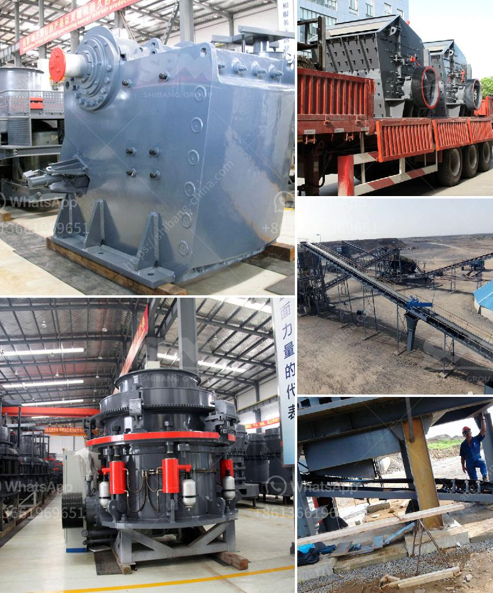

<h3>crushing and grinding processes of platinum</h3>
Platinum, one of the rarest and most precious metals, is renowned for its exceptional properties, including high resistance to corrosion and chemical stability. However, the extraction and refining of platinum require several complex processes, including crushing and grinding, to release its valuable properties.

The initial step in the extraction process of platinum involves drilling and blasting the ore-containing rocks. This process breaks the rocks into smaller fragments, facilitating easier handling and transportation. Following this, the fragmented rocks are further reduced in size through crushing.

Crushing is a mechanical process that uses mechanical forces to break down the larger rocks into smaller, more manageable sizes. In the case of platinum, various types of crushers, such as cone crushers, impact crushers, or gyratory crushers, are utilized. These crushers use intense pressure, impact, or rotating surfaces to break the ore into smaller particles.

After the initial crushing, the crushed platinum material is further ground into finer particles through grinding. Grinding is a process that involves using abrasion and friction forces to break down the ore into smaller particles with increased surface area. This increased surface area facilitates the next step in the extraction process, as it exposes more of the valuable mineral to chemical processes.

Grinding can be done using various equipment, including ball mills, rod mills, or SAG mills. These mills utilize a combination of impact and grinding forces to reduce the size of the platinum material. In some cases, additives such as grinding aids or dispersants may be added to enhance the grinding process.

The crushed and ground platinum material is then subjected to further processing steps, such as flotation, smelting, or chemical leaching, to extract the platinum and separate it from other impurities. These processes are essential in obtaining high-purity platinum for various applications, including jewelry, electronics, and catalytic converters.

In conclusion, the crushing and grinding processes of platinum are vital in unlocking the metal's valuable properties. By breaking down the ore into smaller sizes and increasing its surface area, these processes allow for efficient extraction and refining of platinum. As demand for platinum continues to rise, advancements in crushing and grinding technologies will further enhance the efficiency and sustainability of platinum extraction processes.
<h3>Contact us</h3><ul><li><strong>Whatsapp:&nbsp;<a href="https://wa.me/8613661969651">+8613661969651</a></strong></li><li><a href="https://swt.shibang-china.com/?git&amp;zhl&amp;crushing and grinding processes of platinum"><strong>Online Service(chat now)</strong></a></li></ul><h3>Related</h3><ul><li><a href='ball mill price mexico.md'>ball mill price mexico</a></li><li><a href='coal dryer manufacturer india.md'>coal dryer manufacturer india</a></li><li><a href='crusher machine to make fine powder.md'>crusher machine to make fine powder</a></li><li><a href='used stone crusher for sale in dubai.md'>used stone crusher for sale in dubai</a></li><li><a href='crusher peru price crushing plant.md'>crusher peru price crushing plant</a></li></ul>