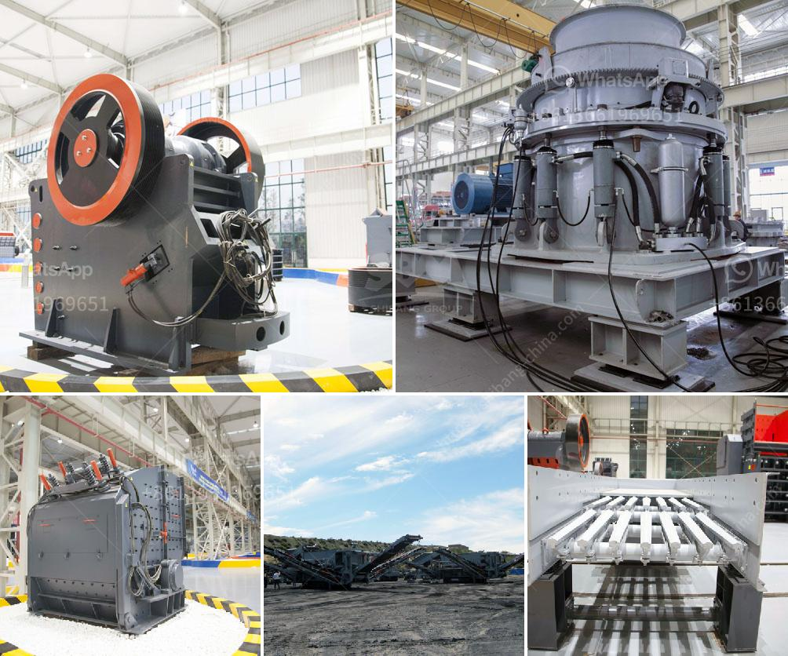

<h3>crushing and grinding</h3>
Crushing and grinding are essential processes in many industries, including mining, construction, and food processing. They are used to separate valuable minerals or ingredients from unwanted materials and prepare them for further use.

Crushing involves the breaking down of solid materials into smaller pieces using mechanical force. This can be achieved through various methods such as compression, impact, or attrition. For instance, in the mining industry, large rocks are crushed into smaller particles to extract valuable minerals like gold or copper. Similarly, in the food industry, ingredients like spices or grains are crushed to enhance flavor or facilitate digestion.

Grinding, on the other hand, is the process of reducing the size of particles by applying force through abrasion or attrition. It involves using a rotating abrasive wheel or other grinding tools to remove excess material from a workpiece or achieve the desired shape or smoothness. In manufacturing industries, grinding is commonly used for finishing processes, smoothing rough surfaces, or sharpening cutting tools.

Both crushing and grinding are crucial steps in the production process, as they directly impact the quality and consistency of the final product. They can significantly affect factors such as particle size, material integrity, and even the overall efficiency of subsequent processes.

Furthermore, advancements in technology have greatly improved the efficiency and effectiveness of crushing and grinding operations. Various equipment, such as crushers, mills, and grinders, have been developed to cater to different industries' specific needs, allowing for faster and more precise processing. Automation and computer control systems have further enhanced productivity and reduced human error.

In conclusion, crushing and grinding play a vital role in many industries, enabling the extraction, refinement, and production of various materials and products. These processes are constantly evolving, driven by technological advancements that aim to optimize efficiency, quality, and sustainability.
<h3>Contact us</h3><ul><li><strong>Whatsapp:&nbsp;<a href="https://wa.me/8613661969651">+8613661969651</a></strong></li><li><a href="https://swt.shibang-china.com/?git&amp;zhl&amp;crushing and grinding"><strong>Online Service(chat now)</strong></a></li></ul><h3>Related</h3><ul><li><a href='german crusher manufacturers.md'>german crusher manufacturers</a></li><li><a href='dolomite crusher turkey 200 ton price.md'>dolomite crusher turkey 200 ton price</a></li><li><a href='pulviriser machine in allahabad.md'>pulviriser machine in allahabad</a></li><li><a href='bentonite manufacturing process image.md'>bentonite manufacturing process image</a></li><li><a href='sample business plan for stone crusher pdf.md'>sample business plan for stone crusher pdf</a></li></ul>