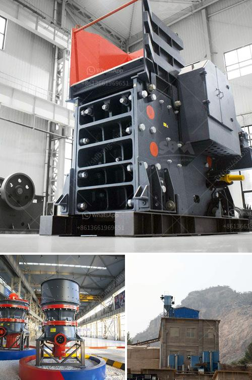

<h3>crushing and screening contractors in south africa</h3>
Crushing and screening contractors play a vital role in the South African mining industry. They are responsible for breaking down larger rocks, creating a more manageable size for further processing, and facilitating the extraction of valuable minerals. These contractors operate alongside mining companies, providing essential services that contribute to the overall productivity and profitability of the sector.

South Africa is known for its abundant mineral resources, including gold, platinum, diamonds, and coal. The mining industry is a significant contributor to the country's economy, and efficient crushing and screening processes are critical for extracting minerals successfully.

Crushing contractors utilize various equipment and machinery to accomplish their tasks. This includes crushers, screens, conveyors, and feeders, among others, all designed to efficiently break down raw materials. These contractors must possess expertise in operating and maintaining these machines, ensuring their smooth operation and preventing any production delays.

Additionally, these contractors must adhere to strict safety measures to protect their workers and the environment. Compliance with health and safety regulations is crucial to prevent accidents and minimize the detrimental impacts of mining activities on the ecosystem.

The services provided by crushing and screening contractors are essential for the mining industry's success. By efficiently processing minerals, these contractors allow mining companies to extract valuable resources, contributing to job creation, economic growth, and infrastructure development in South Africa.

Moreover, crushing and screening contractors often collaborate with mining companies to optimize operations. By understanding the specific needs of each mining project, contractors can tailor their services accordingly, improving efficiency and reducing costs. This collaboration fosters innovation and drives continuous improvements in the industry.

In conclusion, crushing and screening contractors are integral players in South Africa's mining sector. Their expertise and equipment help extract valuable minerals efficiently and sustainably. By contributing to the country's mineral extraction, these contractors aid in driving economic growth and development. Moving forward, it is crucial to support these contractors and promote their collaboration with mining companies to ensure the continued success of the industry.
<h3>Contact us</h3><ul><li><strong>Whatsapp:&nbsp;<a href="https://wa.me/8613661969651">+8613661969651</a></strong></li><li><a href="https://swt.shibang-china.com/?git&amp;zhl&amp;crushing and screening contractors in south africa"><strong>Online Service(chat now)</strong></a></li></ul><h3>Related</h3><ul><li><a href='hammer mill clays price.md'>hammer mill clays price</a></li><li><a href='low cost gold mining equipment gold mining equipment.md'>low cost gold mining equipment gold mining equipment</a></li><li><a href='grinding zeolite ball mill machine.md'>grinding zeolite ball mill machine</a></li><li><a href='harga stone crusher plant ton.md'>harga stone crusher plant ton</a></li><li><a href='machinery for quartz stone.md'>machinery for quartz stone</a></li></ul>