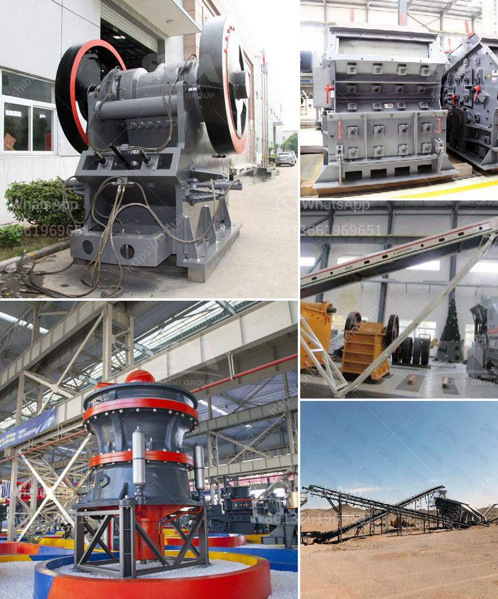

<h3>crushing and screening market in india</h3>
The crushing and screening market in India is growing at a rapid pace due to the increasing demand for construction materials such as stones, aggregates, and sand. These materials are used in roadways, railways, and various other construction activities. In addition, there is a growing demand for mining equipment such as crushers and screens, owing to the expansion of the mining industry in the country.

The government's initiatives to boost infrastructure development and the increasing focus on the construction of smart cities have further fueled the growth of the crushing and screening market in India. With the construction sector witnessing a surge in activity, the demand for high-quality and efficient crushing and screening equipment has also increased.

Various multinational companies and local players are tapping into this lucrative market by introducing technologically advanced machinery to cater to the rising demand. These machines are designed to provide high productivity, low maintenance, and reduced downtime, thereby maximizing returns for customers.

Moreover, the increasing awareness about the benefits of using manufactured sand instead of river sand in construction has also contributed to the growth of the crushing and screening market. Manufactured sand is produced by crushing rocks and stones and is an efficient alternative to river sand due to its consistent particle size and absence of impurities.

However, challenges such as the availability of skilled operators and the high cost of these equipment pose a hindrance to the market growth. To address these issues, companies are investing in training programs to enhance the skillset of operators and are also offering competitive pricing and financing options to attract customers.

In conclusion, the crushing and screening market in India is witnessing significant growth, driven by the increasing demand for construction materials and the government's infrastructure development initiatives. With companies introducing advanced machinery and addressing challenges, the market is expected to continue to expand in the coming years.
<h3>Contact us</h3><ul><li><strong>Whatsapp:&nbsp;<a href="https://wa.me/8613661969651">+8613661969651</a></strong></li><li><a href="https://swt.shibang-china.com/?git&amp;zhl&amp;crushing and screening market in india"><strong>Online Service(chat now)</strong></a></li></ul><h3>Related</h3><ul><li><a href='stone crushers plant prices.md'>stone crushers plant prices</a></li><li><a href='crushers for sale in.md'>crushers for sale in</a></li><li><a href='kokstad grinding mill for sale.md'>kokstad grinding mill for sale</a></li><li><a href='clinker grinding machine.md'>clinker grinding machine</a></li><li><a href='coal mill outlet temperature.md'>coal mill outlet temperature</a></li></ul>