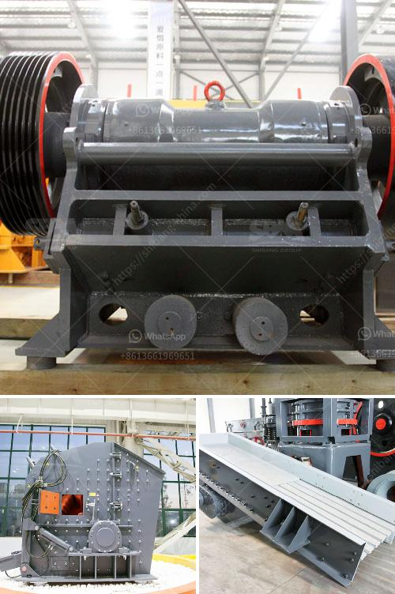

<h3>crushing and serreing machinery</h3>
Crushing and sieving machinery forms the backbone of various industries, particularly those involved in mining, construction, and waste management. These machines play a vital role in crushing solid materials into smaller sizes and separating valuable particles from unwanted debris. Their efficiency, reliability, and versatility have made them indispensable equipment in many operations.

One of the key functionalities of crushing machinery is reducing the size of rocks, stones, or minerals. This process is essential for various applications such as creating concrete aggregate, producing fine sand, or crushing ores for mineral extraction. Crushers are designed to handle different types of materials, including dense and hard substances like granite or basalt.

There are several types of crushers available, each designed to cater to specific material requirements. Jaw crushers are commonly used in the primary stage of crushing, where the material is initially blasted or excavated. They rely on compressive force to break down large rocks into smaller, more manageable sizes.

Cone crushers, on the other hand, are well-suited for secondary and tertiary crushing stages. They operate by squeezing the material between an eccentrically rotating cone and a concave surface, effectively reducing it further. Cone crushers are widely used for their ability to handle abrasive and hard materials, making them highly sought after in mining operations.

Crushing machinery is designed to be robust and able to withstand heavy-duty applications. They often feature high-strength materials, such as hardened steel, and incorporate advanced technologies to enhance their durability. Safety mechanisms are also implemented to protect the operators and prevent accidents.

Sieving machinery, on the other hand, is employed to separate various particles based on size. This process is crucial in numerous industries, including agriculture, recycling, and mining. Sieves and screens with different mesh sizes are used to separate oversized particles and ensure the desired uniformity of the final product.

Vibrating screens are commonly used for sieving applications. They consist of a meshed surface that vibrates, causing the particles to segregate based on their size. These screens are highly efficient and can handle high volumes of materials while maintaining accuracy in separation.

Besides crushing and sieving, these machines can be further enhanced with additional components. For instance, magnetic separators can be incorporated to extract ferrous materials from a mixture. This is especially important in recycling operations where the separation of metallic components is crucial.

In conclusion, crushing and sieving machinery plays a vital role in various industries, enabling the reduction of solids to desired sizes and the separation of valuable particles from waste materials. These machines are crucial for mining, construction, and waste management operations, as they provide the necessary efficiency, reliability, and versatility. The development of advanced crushing and sieving technologies has further improved the performance and safety of these machines. Their continued innovation ensures that these machines remain essential equipment for many industries in the years to come.
<h3>Contact us</h3><ul><li><strong>Whatsapp:&nbsp;<a href="https://wa.me/8613661969651">+8613661969651</a></strong></li><li><a href="https://swt.shibang-china.com/?git&amp;zhl&amp;crushing and serreing machinery"><strong>Online Service(chat now)</strong></a></li></ul><h3>Related</h3><ul><li><a href='cement plant for sale south africa.md'>cement plant for sale south africa</a></li><li><a href='stone crusher cameroon.md'>stone crusher cameroon</a></li><li><a href='used granite crushers for sale.md'>used granite crushers for sale</a></li><li><a href='slag crusher machine india.md'>slag crusher machine india</a></li><li><a href='crushers of jaw china.md'>crushers of jaw china</a></li></ul>