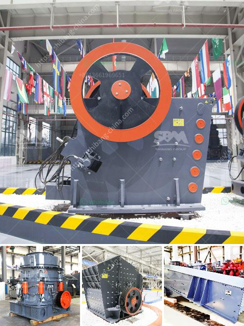

<h3>crushing machine price in malaysia</h3>
Malaysia is a southeastern country with a robust industrial sector and a wealth of natural resources. As the economy continues to thrive, the demand for construction and mining equipment is increasing rapidly. In recent years, crushing machines have garnered significant attention due to their importance in the construction and mining industries. Consequently, the crushing machine price in Malaysia has been a subject of interest among buyers and investors.

The price of crushing machines in Malaysia varies depending on several factors, such as the brand, model, capacity, and specifications. The demand for machines with higher processing capacity, such as jaw crushers and cone crushers, is increasing. Additionally, the rapid growth in the construction and mining sectors necessitates the use of more advanced crushing machines. These factors contribute to the fluctuating prices observed in the Malaysian market.

One of the primary determinants of crushing machine prices in Malaysia is the brand. Well-established brands such as Metso, Sandvik, and Terex are known for their reliable and high-quality machines. However, these renowned brands often come with a higher price tag compared to lesser-known brands. The reputation and reliability associated with certain brands make them highly sought after by buyers, resulting in a premium price.

Another influential factor in determining the price of crushing machines in Malaysia is the machine model. Different models offer varying features and capacities, catering to different needs and applications. As more advanced technologies are incorporated into new models, the prices tend to increase accordingly. For instance, a machine with a higher crushing capacity will generally be priced higher than one with a lower capacity due to the increased functionality.

The capacity and specifications of the machine play a crucial role in determining its price. Crushing machines with higher capacities are ideal for large-scale construction and mining projects, thus commanding a higher price. Moreover, machines with additional features and specifications, such as adjustable settings, automation, and remote-control capabilities, tend to have a higher price range. These extra features enhance productivity and convenience, making them an attractive option for many buyers.

Furthermore, the availability and accessibility of spare parts and after-sales services significantly influence the price of crushing machines in Malaysia. Brands and models with a well-established distribution network and strong customer support tend to have higher prices due to the added value provided by smoother operations and reliable services. Conversely, machines from lesser-known brands or those without a reliable spare parts supply chain often have lower prices to compensate for the potential challenges faced by buyers when it comes to maintenance and repairs.

In conclusion, the price of crushing machines in Malaysia is subject to numerous factors, including brand reputation, model, capacity, specifications, and after-sales services. Buyers and investors should carefully consider their requirements and budget when making purchasing decisions. While renowned brands and high-capacity machines come with a higher price tag, they often offer better quality, reliability, and support. Conversely, lesser-known brands may offer lower prices but could present challenges in terms of availability and support. Therefore, conducting thorough research and engaging with reputable suppliers is crucial to making an informed decision and obtaining the most cost-effective and suitable crushing machine for specific purposes.
<h3>Contact us</h3><ul><li><strong>Whatsapp:&nbsp;<a href="https://wa.me/8613661969651">+8613661969651</a></strong></li><li><a href="https://swt.shibang-china.com/?git&amp;zhl&amp;crushing machine price in malaysia"><strong>Online Service(chat now)</strong></a></li></ul><h3>Related</h3><ul><li><a href='gypsum mining crusher in kenya manufacturer.md'>gypsum mining crusher in kenya manufacturer</a></li><li><a href='calcite manufacturing.md'>calcite manufacturing</a></li><li><a href='coal crusher and screening plants for sale.md'>coal crusher and screening plants for sale</a></li><li><a href='chilli crushing machine project report.md'>chilli crushing machine project report</a></li><li><a href='mining equipment in turkey.md'>mining equipment in turkey</a></li></ul>