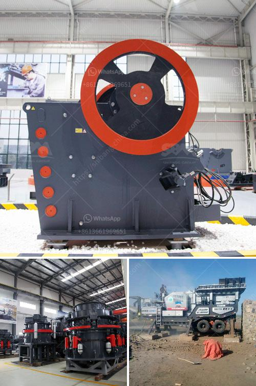

<h3>crushing plant assembly</h3>
In any industrial context, the utilization of crushing plants is fundamental in the production of aggregate, rocks, gravel, minerals, and other commonly used materials. From construction to manufacturing, these plants are indispensable in the processing of raw materials for various purposes. However, the assembly of a crushing plant is a complex task that requires meticulous planning, skilled labor, and efficient coordination.

The assembly process of a crushing plant involves multiple stages, each requiring different machinery, resources, and technical expertise. It begins with the procurement of all necessary components, such as crushers, conveyors, screens, and feeders, which are selected based on their compatibility with the type of material to be processed. These components need to be sourced from reliable suppliers to ensure quality and compliance with industry standards.

Once all the necessary components have been acquired, the next step is to create a detailed assembly plan that outlines the specific arrangement and integration of each unit. This plan should consider factors such as space availability, accessibility for maintenance and repairs, and safety measures for workers. A carefully crafted assembly plan can minimize downtime, reduce costs, and maximize overall efficiency.

The actual assembly of the crushing plant involves the expertise of technicians and engineers who have a deep understanding of the machinery being used. These professionals follow the assembly plan meticulously, ensuring that each component is properly connected, aligned, and secured. They also conduct thorough inspections and tests to guarantee the correct functioning of the entire system.

During the assembly process, it is essential to implement strict quality control measures. This ensures that the crushing plant is built to last and capable of withstanding demanding operational conditions. Regular inspections, adherence to safety regulations, and proper training for workers are all critical to the success of a crushing plant assembly.

Moreover, efficient supply chain management plays a crucial role in the successful assembly of a crushing plant. Timely delivery of components, coordination with suppliers, and continuous communication with all stakeholders are essential to avoid delays and keep the assembly process on schedule. Good supply chain management practices contribute to the smooth and uninterrupted functioning of the plant once it is operational.

Lastly, it is important to acknowledge the environmental impact of the assembly process and ensure sustainable practices are followed. This includes utilizing eco-friendly materials, implementing energy-efficient systems, and adhering to waste management regulations. The assembly of a crushing plant must be done in a manner that minimizes harm to the environment and promotes the overall well-being of the surrounding ecosystem.

In conclusion, the assembly of a crushing plant is a critical stage in the production process that requires careful planning, skilled labor, and efficient coordination. It involves the procurement of necessary components, the creation of a detailed assembly plan, the precise integration of various units, and the implementation of strict quality control measures. The successful assembly of a crushing plant ensures the smooth and uninterrupted production of essential materials for various industries, contributing to economic growth and development.
<h3>Contact us</h3><ul><li><strong>Whatsapp:&nbsp;<a href="https://wa.me/8613661969651">+8613661969651</a></strong></li><li><a href="https://swt.shibang-china.com/?git&amp;zhl&amp;crushing plant assembly"><strong>Online Service(chat now)</strong></a></li></ul><h3>Related</h3><ul><li><a href='quartz ball for ball milling.md'>quartz ball for ball milling</a></li><li><a href='tracked jaw crusher for sale.md'>tracked jaw crusher for sale</a></li><li><a href='brand of ball mills.md'>brand of ball mills</a></li><li><a href='stone crushing plant cost in pakistan.md'>stone crushing plant cost in pakistan</a></li><li><a href='used cone crusher for sale ton per hour.md'>used cone crusher for sale ton per hour</a></li></ul>