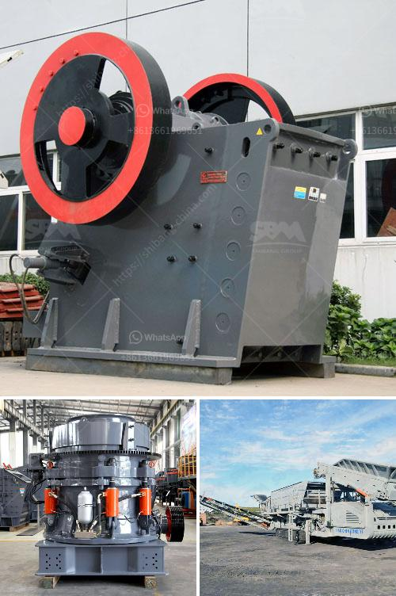

<h3>crushing plant for sale in tanzania</h3>
Tanzania is home to some of the most pristine and expansive natural reserves in the world. Therefore, it is quite fitting that the crushing plant for sale in Tanzania serves such a wide range of purposes. When it comes to undertaking heavy-duty and demanding industrial work, it is important to have an efficient and reliable machine that can break down different types of raw materials. In this article, we will take a closer look at the crushing plant for sale in Tanzania and explore the many uses and advantages it offers.

First and foremost, the crushing plant for sale in Tanzania is designed to process medium-hard rocks and minerals, such as limestone, granite, basalt, andesite, gravel, sandstone, gypsum, and various ores. These raw materials are ground seeking to achieve different grades of granularity for different industries. By utilizing a crushing plant, companies can produce materials for various applications, including road construction, building construction, cement production, and even the concrete industry.

One of the most notable advantages of a crushing plant is its ability to produce materials in different sizes, depending on the client's requirements. The crushing process typically begins with a primary crushing stage, where large rocks or raw materials are fed into the machine. These materials are then crushed into smaller pieces, usually with the help of jaw crushers or cone crushers. From there, the crushed material undergoes further processing, such as screening and recirculation, to achieve the desired size and quality.

Additionally, a crushing plant for sale in Tanzania is highly flexible and easily adaptable to a variety of different working environments. The machine can be used in a stationary configuration or be easily transported to a different site, depending on the needs of the project. This versatility makes it an ideal choice for both small-scale and large-scale construction projects, allowing companies to save time and money by eliminating the need for multiple machines.

Moreover, a crushing plant for sale in Tanzania is also an environmentally friendly option. With the increasing concern for sustainable development, it is important to choose machinery that minimizes its environmental impact. Modern crushing plants are designed to reduce dust and noise pollution, utilizing advanced technologies and systems to ensure workers' safety and well-being. Additionally, some crushing plants are equipped with dust suppression systems that minimize dust emissions during operation, further contributing to a cleaner and healthier work environment.

In conclusion, a crushing plant for sale in Tanzania is a valuable asset to have for any construction, mining, or quarrying company. It allows them to produce high-quality materials in an efficient and cost-effective manner. The flexibility and versatility of the machine make it suitable for a variety of different projects, while its environmentally friendly features align with the growing demands for sustainable development. As Tanzania continues to grow and develop, the demand for construction materials will undoubtedly rise, making the crushing plant an essential investment for those in the industry.
<h3>Contact us</h3><ul><li><strong>Whatsapp:&nbsp;<a href="https://wa.me/8613661969651">+8613661969651</a></strong></li><li><a href="https://swt.shibang-china.com/?git&amp;zhl&amp;crushing plant for sale in tanzania"><strong>Online Service(chat now)</strong></a></li></ul><h3>Related</h3><ul><li><a href='production process of limestone.md'>production process of limestone</a></li><li><a href='rotary kiln cement plant cost in india.md'>rotary kiln cement plant cost in india</a></li><li><a href='crushing plant in maule.md'>crushing plant in maule</a></li><li><a href='lime and dolomite plant in india.md'>lime and dolomite plant in india</a></li><li><a href='ton per hour coal crushing plant.md'>ton per hour coal crushing plant</a></li></ul>