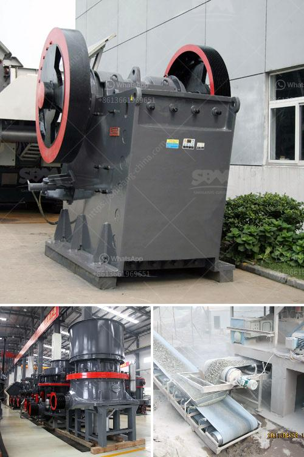

<h3>crushing plant for sale philippines</h3>
The Philippines is a country rich in mineral resources and oozing with potential for economic growth. With its extensive coastline, lush forests, and scenic landscapes, the country is truly a sight to behold. It comes as no surprise that the Philippines has become a haven for mining and quarrying activities. As such, the need for crushing plants has also increased, giving rise to a lucrative market for crushing plant for sale in the Philippines.

A crushing plant is a machine that reduces size of rock material or other materials used in mining, metallurgical and construction industries. Crushing plants are also used in the aggregate industry to crush sand and gravel, limestone, basalt and granite, into smaller pieces. However, with the rapid development of the Philippines and the increasing demand for infrastructure construction, it is estimated that the market for crushing plants will increase exponentially in the coming years.

One of the leading suppliers of crushing plants in the Philippines is AIMIX Group. As an experienced and trustworthy manufacturer, we have designed and built numerous crushing plants for many different applications, including jaw crushers, impact crushers, cone crushers, and more. Our crushing plants are known for their durability, efficiency, and versatility.

What sets AIMIX Group's crushing plants apart from others on the market is their adaptability and customization options. We understand that each client has unique requirements and specifications, which is why we offer a range of different models and configurations to choose from. Whether you need a portable crushing plant for on-site crushing or a stationary crushing plant for larger-scale operations, AIMIX Group has you covered.

Furthermore, our crushing plants are built with the highest quality materials and components to ensure long-lasting performance. We believe in providing our customers with reliable and efficient equipment that can withstand the harsh conditions of the mining and quarrying industry. Additionally, our crushing plants are equipped with advanced technology and automation systems, making them safer and more user-friendly.

In addition to our high-quality crushing plants, AIMIX Group also offers comprehensive after-sales service. We are committed to providing our customers with ongoing technical support and assistance. Our team of technicians and engineers are available to answer any questions and solve any problems that may arise. We also offer regular maintenance checks and spare parts supply to ensure the smooth operation of your crushing plant.

If you are in the market for a crushing plant in the Philippines, look no further than AIMIX Group. With our extensive range of crushing plants and our commitment to customer satisfaction, we are confident that we can meet your needs and exceed your expectations. Contact us today to learn more about our crushing plants for sale in the Philippines and how we can help you achieve your goals.
<h3>Contact us</h3><ul><li><strong>Whatsapp:&nbsp;<a href="https://wa.me/8613661969651">+8613661969651</a></strong></li><li><a href="https://swt.shibang-china.com/?git&amp;zhl&amp;crushing plant for sale philippines"><strong>Online Service(chat now)</strong></a></li></ul><h3>Related</h3><ul><li><a href='sand washing machine in saudi arabia.md'>sand washing machine in saudi arabia</a></li><li><a href='impact crusher tanzania.md'>impact crusher tanzania</a></li><li><a href='mining and machine in turkey.md'>mining and machine in turkey</a></li><li><a href='10 tph trally mounted stone crusher made in india.md'>10 tph trally mounted stone crusher made in india</a></li><li><a href='quartz stone powder mill.md'>quartz stone powder mill</a></li></ul>