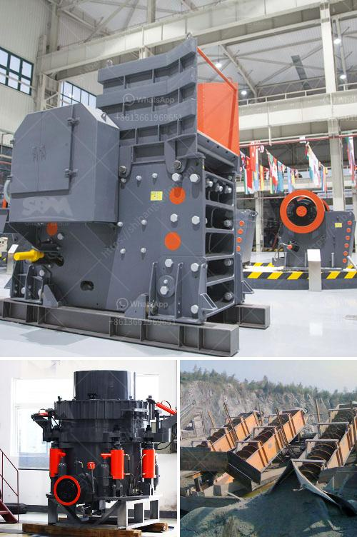

<h3>crushing plant in maule</h3>
The Maule region in Chile is home to several crushing plants that play a vital role in the local economy. These plants are responsible for processing large rocks and stones into smaller aggregates, which are used in the construction industry. With a wide range of applications, crushing plants are essential for infrastructure projects, road construction, and concrete production.

One of the key benefits of having crushing plants in Maule is the convenience it provides to construction companies and contractors. By having these facilities readily available in the region, transportation costs and time are significantly reduced. This ensures a seamless supply of crushed materials to meet the growing demand in the area.

Additionally, crushing plants contribute to the sustainability and environmental impact of construction projects. By recycling materials from demolished structures, the need for extracting new resources is minimized. This reduces the carbon footprint associated with mining activities and preserves natural resources.

Moreover, crushing plants in Maule provide employment opportunities for the local population. The operation and maintenance of these facilities require a skilled workforce, creating jobs and boosting economic growth in the region. This is particularly important in rural areas where job opportunities may be limited.

In recent years, crushing plants in Maule have implemented advanced technologies to optimize production processes and minimize environmental impact further. These technologies include dust control systems, noise reduction measures, and water recycling systems. By investing in these technologies, the industry aims to align with sustainable practices and ensure the well-being of both workers and the surrounding communities.

In conclusion, crushing plants in Maule are crucial for the construction industry, providing essential materials for infrastructure projects while contributing to sustainable development. With their role in reducing transportation costs, minimizing environmental impact, and generating employment opportunities, these plants play a vital role in the region's economic growth and development.
<h3>Contact us</h3><ul><li><strong>Whatsapp:&nbsp;<a href="https://wa.me/8613661969651">+8613661969651</a></strong></li><li><a href="https://swt.shibang-china.com/?git&amp;zhl&amp;crushing plant in maule"><strong>Online Service(chat now)</strong></a></li></ul><h3>Related</h3><ul><li><a href='crushing plant in maule.md'>crushing plant in maule</a></li><li><a href='vertical shaft impact crusher price.md'>vertical shaft impact crusher price</a></li><li><a href='jaw crusher buatan philippines 250 ton hari.md'>jaw crusher buatan philippines 250 ton hari</a></li><li><a href='ballast crusher sale kenya.md'>ballast crusher sale kenya</a></li><li><a href='gypsum powder price in south africa.md'>gypsum powder price in south africa</a></li></ul>