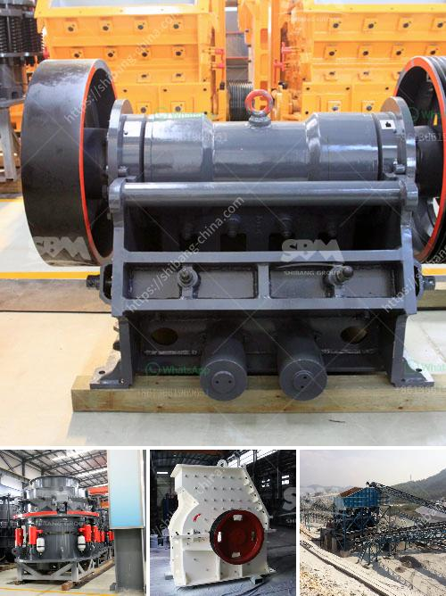

<h3>crushing plant montalban</h3>
Montalban is a municipality in the province of Rizal, located approximately 22 kilometers east of Manila, the capital city of the Philippines. Its strategic location makes it accessible to various parts of Luzon, which is necessary for the booming construction industry in the area.

One important facility that is essential to this industry is the Montalban Crushing Plant. In fact, this plant is integral to the overall development of the area. The plant is responsible for manufacturing a wide range of aggregate products, which are then distributed across various construction companies within the region.

The primary function of the crushing plant is to reduce large rocks into smaller pieces. These smaller pieces are then used in creating concrete, asphalt, and other building materials. The process starts by feeding the rocks into a primary crusher, where they are broken down into manageable sizes. From there, the crushed rocks are transported to a secondary crusher which further reduces their size. Finally, a vibrating screen separates the different sizes of aggregate, ensuring that it meets the required specifications.

What sets the Montalban Crushing Plant apart from other crushing plants is its sustainability. The plant uses solar panels as an alternative energy source, further reducing the carbon emissions that are released into the atmosphere. The solar panels provide enough energy to power the entire plant, making it one of the most eco-friendly crushing plants in the country.

Moreover, the Montalban Crushing Plant takes pride in its noteworthy safety practices. Regular inspections are conducted to ensure that all equipment is functioning properly and that the plant is in compliance with all safety regulations. Workers are provided with appropriate safety gear and are trained on the proper use of equipment to prevent accidents or injuries.

The plant also adheres to strict quality control measures to guarantee that the aggregate products produced are of the highest standard. The aggregates are regularly tested and analyzed to ensure that they meet the required specifications set by the construction companies. This ensures that the final product will perform as intended and meet the structural requirements of various construction projects.

Overall, the Montalban Crushing Plant plays a crucial role in the construction industry in Montalban and surrounding areas. Its sustainable practices and focus on safety and quality control make it one of the preferred suppliers of aggregate materials for construction companies.

As the demand for construction materials continues to grow, the crushing plant is constantly evolving and improving its processes to meet the needs of the industry. It serves as a testament to Montalban's commitment to sustainable development and responsible construction practices.

In conclusion, the Montalban Crushing Plant is an integral part of the construction industry in Montalban and surrounding areas. With its sustainable practices, focus on safety, and commitment to quality control, it has become a preferred supplier for various construction companies. The crushing plant plays a vital role in the development of the region and contributes to the overall growth of the construction industry in Montalban.
<h3>Contact us</h3><ul><li><strong>Whatsapp:&nbsp;<a href="https://wa.me/8613661969651">+8613661969651</a></strong></li><li><a href="https://swt.shibang-china.com/?git&amp;zhl&amp;crushing plant montalban"><strong>Online Service(chat now)</strong></a></li></ul><h3>Related</h3><ul><li><a href='second hand equipment for sale in south africa.md'>second hand equipment for sale in south africa</a></li><li><a href='how to machine limestone.md'>how to machine limestone</a></li><li><a href='aggregate washing plant.md'>aggregate washing plant</a></li><li><a href='small scale mining rock crushers for sale.md'>small scale mining rock crushers for sale</a></li><li><a href='calcium carbonate milling machine.md'>calcium carbonate milling machine</a></li></ul>