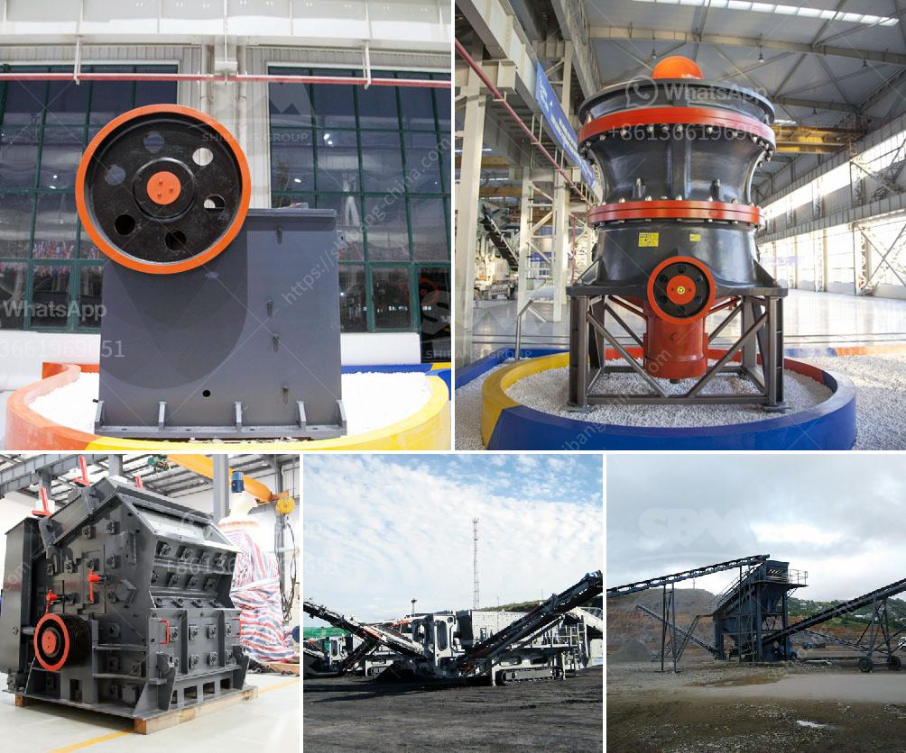

<h3>crushing plant philippines</h3>
The Philippines is known for its rich biodiversity and natural resources, making it a prime location for various industries, including the crushing plant industry. Over the years, the crushing plant industry in the Philippines has grown significantly due to the increasing demand for aggregates and materials for construction projects.

A crushing plant is a machine that reduces the size of materials, such as rock, ore, or debris through compression or impact. This mechanical force is achieved by using machines such as jaw crushers, cone crushers, and impact crushers. The crushing plant can be stationary or mobile, making it suitable for various construction applications.

One of the primary uses of a crushing plant is in the mining industry. Initially, the mined ores are processed into smaller size for further processing. These ores can be used for manufacturing various metal products, such as steel and aluminum. The Philippines is known for its rich mineral resources, including gold, copper, and nickel. Therefore, the crushing plant industry plays a crucial role in extracting and processing these mineral ores.

Another significant application of a crushing plant is in the construction industry. Aggregates, including crushed stone, gravel, and sand, are essential materials for building roads, bridges, and buildings. The construction industry in the Philippines is booming, with numerous infrastructure projects being undertaken throughout the country. As a result, there is a growing demand for high-quality aggregates, driving the need for efficient crushing plants.

Aside from mining and construction, the crushing plant industry also caters to the recycling industry. Recycling plants often utilize crushing machines to reduce the size of waste materials, such as concrete, bricks, and asphalt. These crushed materials can then be used as recycled aggregates in various construction applications. By recycling these materials, the crushing plant industry contributes to reducing waste and promoting sustainability.

In recent years, the crushing plant industry in the Philippines has faced several challenges. One of the major challenges is ensuring environmental compliance and sustainability. The industry is striving to implement environmentally friendly practices, such as using water-spraying systems to control dust emissions and adopting energy-efficient machinery. Additionally, the industry is also focused on responsible mining practices to mitigate the environmental impacts associated with mining operations.

Despite these challenges, the crushing plant industry in the Philippines continues to thrive. The constant demand for aggregates, coupled with the country's rich mineral resources, ensures a steady growth in the industry. Moreover, the advancement in technology has led to the development of more efficient and eco-friendly crushing plants, further bolstering the industry's growth.

In conclusion, the crushing plant industry in the Philippines plays a crucial role in various sectors, including mining, construction, and recycling. It is a vital component of the country's economy and contributes to its development. As the demand for aggregates continues to rise, it is essential for the industry to adopt sustainable practices and further innovate to meet the growing needs of the market.
<h3>Contact us</h3><ul><li><strong>Whatsapp:&nbsp;<a href="https://wa.me/8613661969651">+8613661969651</a></strong></li><li><a href="https://swt.shibang-china.com/?git&amp;zhl&amp;crushing plant philippines"><strong>Online Service(chat now)</strong></a></li></ul><h3>Related</h3><ul><li><a href='bentonite processing plant.md'>bentonite processing plant</a></li><li><a href='10 allis chalmers jaw crusher.md'>10 allis chalmers jaw crusher</a></li><li><a href='vertical mill coal.md'>vertical mill coal</a></li><li><a href='limestone milling machine made in russia.md'>limestone milling machine made in russia</a></li><li><a href='iron ore grinding ball mill details.md'>iron ore grinding ball mill details</a></li></ul>