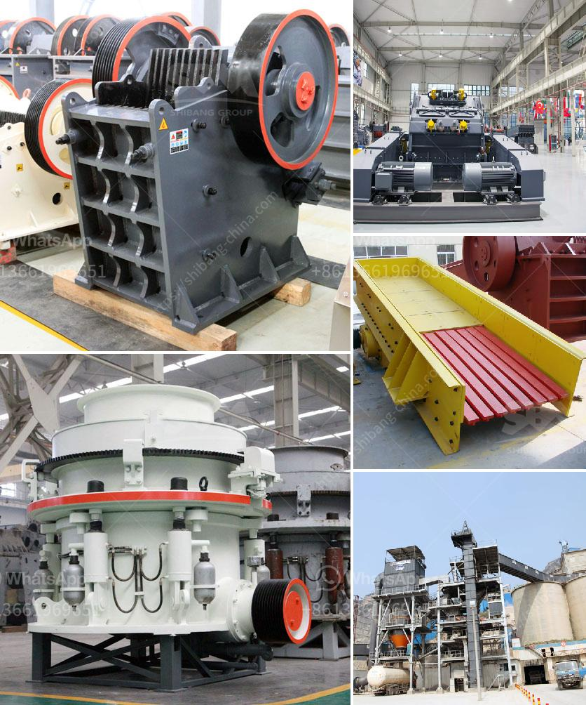

<h3>crushing plant price list</h3>
A crushing plant is a facility designed to break rocks into smaller pieces. In today's mining industry, there are various types of crushing plants, each designed for specific applications. In order to obtain the most efficient and cost-effective solution, it is crucial to determine the capacity requirements, material specifications, and operational features of a crushing plant.

When it comes to purchasing a crushing plant, one important factor to consider is its price. The price of a crushing plant can vary depending on various factors such as the type of machinery, the capacity of the plant, the specific configuration, and the overall quality of the equipment. Therefore, it is crucial to have a clear understanding of what is included in the price list of a crushing plant.

First and foremost, the price of a crushing plant is heavily influenced by its capacity. The capacity refers to the maximum amount of material that the plant can process per hour or per day. It is essential to determine the required capacity based on the production needs of the operation. A higher capacity crushing plant will generally have a higher price due to the larger and more powerful machinery required.

Secondly, the price of a crushing plant is influenced by the type of machinery included. There are various types of crushers available, including jaw crushers, cone crushers, impact crushers, and more. Each type of crusher has different features and capabilities, leading to variations in their prices. For example, a jaw crusher may be less expensive compared to a cone crusher, but it may also have limitations in terms of the materials it can handle.

Additionally, the specific configuration of a crushing plant can also affect its price. Some crushing plants come with additional features and accessories that can enhance their performance and functionality. These may include a vibrating feeder, a scalping screen, or a conveyor belt system. The more advanced the configuration, the higher the price may be.

Lastly, the overall quality and reputation of the equipment manufacturer can have an impact on the price of a crushing plant. It is always recommended to choose a reputable manufacturer that has a track record of producing high-quality and reliable equipment. While the initial investment may be higher, it can result in better operational efficiency, lower maintenance costs, and ultimately, higher returns on investment.

In conclusion, the price list of a crushing plant can vary depending on various factors. It is crucial to thoroughly assess the capacity requirements, material specifications, and operational features of a plant to determine the best value for your investment. By considering these factors and choosing a reputable manufacturer, you can ensure that you are getting the most efficient and cost-effective crushing plant for your mining operation.
<h3>Contact us</h3><ul><li><strong>Whatsapp:&nbsp;<a href="https://wa.me/8613661969651">+8613661969651</a></strong></li><li><a href="https://swt.shibang-china.com/?git&amp;zhl&amp;crushing plant price list"><strong>Online Service(chat now)</strong></a></li></ul><h3>Related</h3><ul><li><a href='stone crusher company in dubai.md'>stone crusher company in dubai</a></li><li><a href='small scale mining partnership crusher.md'>small scale mining partnership crusher</a></li><li><a href='sand making machine cost.md'>sand making machine cost</a></li><li><a href='difference between raymond mill and ball mill.md'>difference between raymond mill and ball mill</a></li><li><a href='price jaw crusher price stone crusher.md'>price jaw crusher price stone crusher</a></li></ul>