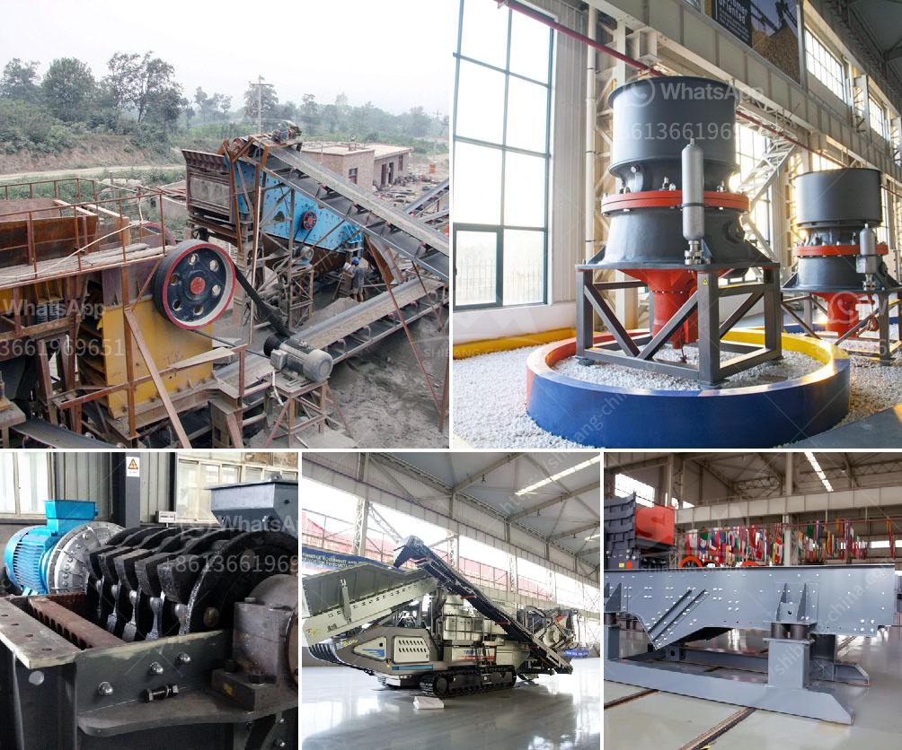

<h3>crushing plant working</h3>
A crushing plant is a large machine that is used to crush various stones and rocks which are used in many different industries. Crushing plants can be stationary or mobile crushing plants, depending on the requirements of the client. Crushing plants are widely used in construction, mining, garbage disposal, metallurgy, chemical industry, building materials, water conservancy, hydropower, and other industries.

The working principle of a crushing plant is fairly simple. The primary crushing stage begins with the hopper where stones and rocks are fed into the jaw crusher to be crushed. The crushed materials are then conveyed to the secondary crushing stage, usually through a conveyor belt. In this stage, the cone crusher is used to further crush the materials into smaller sizes. After the secondary crushing stage, the materials are sorted into different sizes by vibrating screens, and the final product is discharged from the conveyer belt.

The crushing plant is powered by a diesel or electric motor for efficient operation. This enables the plant to be used in remote locations where there is no access to electricity or if there are frequent power outages. The diesel engine option also makes the crushing plant more cost-effective to operate as it requires less maintenance and does not depend on the availability of electricity.

Crushing plants are highly versatile and can be customized to meet the specific requirements of the client. Different types of crushers can be used in a crushing plant depending on the types of stones or rocks being crushed. Some common types of crushers include jaw crushers, cone crushers, impact crushers, and hammer crushers. Each type of crusher has its own advantages and disadvantages, and the choice of crusher depends on factors such as the hardness of the materials, the desired final product size, and the capacity requirements.

One of the major benefits of using a crushing plant is that it can crush large materials into smaller sizes, which makes it easier to transport and handle. This reduces the overall cost of transportation and disposal of waste materials. In addition, crushing plants also help to reduce the environmental impact by reducing the need for mining and quarrying activities, which can cause land degradation and damage to ecosystems.

In conclusion, a crushing plant plays a vital role in various industries by crushing stones and rocks into smaller sizes for use in construction, mining, and other applications. It is a cost-effective and efficient way to process materials, and it reduces the environmental impact of mining and quarrying activities. With advancements in technology, crushing plants are becoming more efficient and versatile, making them an essential machine in today's industrial world.
<h3>Contact us</h3><ul><li><strong>Whatsapp:&nbsp;<a href="https://wa.me/8613661969651">+8613661969651</a></strong></li><li><a href="https://swt.shibang-china.com/?git&amp;zhl&amp;crushing plant working"><strong>Online Service(chat now)</strong></a></li></ul><h3>Related</h3><ul><li><a href='100tph stationery stone crushing plant.md'>100tph stationery stone crushing plant</a></li><li><a href='bison 120 crusher for sale.md'>bison 120 crusher for sale</a></li><li><a href='kenya quartz crushing.md'>kenya quartz crushing</a></li><li><a href='primary crusher ball milling pengertian.md'>primary crusher ball milling pengertian</a></li><li><a href='grinding mill gold ore.md'>grinding mill gold ore</a></li></ul>