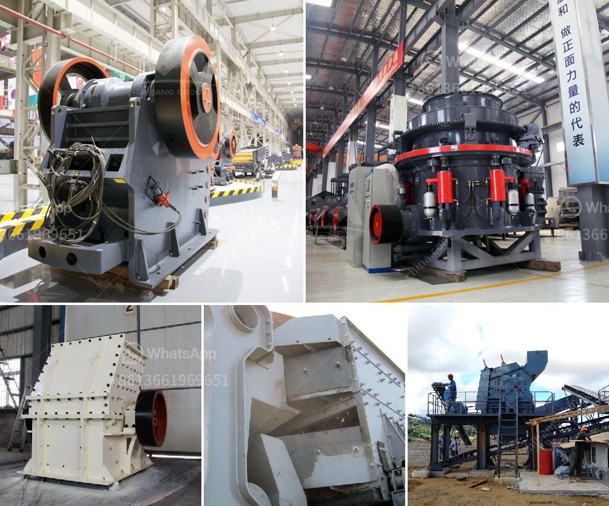

<h3>crussher stone manufacturer in south africa</h3>
With the development of the global economy, international mining machinery industry has gradually revealed the trend of globalization. Under such circumstances, many industries have opted to distribute their products and services to different regions and countries around the world. The crusher stone manufacturer in South Africa is becoming more and more popular due to its excellent performance and high-quality products.

We, the customers from South Africa, are lucky to have a professional crusher stone manufacturer in South Africa. The company has a large scale manufacturing plant and professional team to produce high-quality and reliable crushers and stone crushing machines suitable for various industries, including mining, cement, coal, metallurgy, construction materials, and road maintenance. With the continuous expansion of market demand, their products have been exported to many countries and regions around the world, such as Southeast Asia, Middle East, Africa, Europe, and the Americas.

Why are the products of this crusher stone manufacturer so popular? There are several reasons for its success in the global market.

Firstly, the crusher stone manufacturer in South Africa has a deep understanding of the local market and customers' needs, especially in terms of product quality. The company’s strong technical team manufactures their products with precision, ensuring that they meet the highest standards. The crushers and stone crushing machines are known for their excellent performance, durability, and long service life. This level of quality assurance makes them a preferred choice for many customers.

Secondly, the company has a strong commitment to customer satisfaction. They provide comprehensive pre-sales and after-sales services, including technical guidance, installation, and debugging support, as well as regular equipment maintenance and servicing. In addition, the crusher stone manufacturer offers customized solutions to meet various requirements in different industries. They also continuously improve their products and optimize their performance to better adapt to market changes and customers' demands.

Lastly, the crusher stone manufacturer in South Africa continually invests in research and development to enhance their technological capabilities. They understand that innovation is the driving force for sustainable development. By continuously improving product design, manufacturing processes, and technological innovation, they are able to stay ahead of the competition and provide customers with cutting-edge products that deliver superior performance and efficiency.

In conclusion, the crusher stone manufacturer in South Africa is constantly striving to improve its technology and processes, as well as its products. With a deep understanding of the market and customer needs, they have successfully entered the global market and gained recognition for their high-quality crushers and stone crushing machines. As South Africa's mining industry continues to expand, the crusher stone manufacturer will continue to thrive and provide value to both local and international customers.
<h3>Contact us</h3><ul><li><strong>Whatsapp:&nbsp;<a href="https://wa.me/8613661969651">+8613661969651</a></strong></li><li><a href="https://swt.shibang-china.com/?git&amp;zhl&amp;crussher stone manufacturer in south africa"><strong>Online Service(chat now)</strong></a></li></ul><h3>Related</h3><ul><li><a href='cone crusher 250tph.md'>cone crusher 250tph</a></li><li><a href='limestone grinding machine bangladesh.md'>limestone grinding machine bangladesh</a></li><li><a href='deasel stone crushers and prices in gauteng.md'>deasel stone crushers and prices in gauteng</a></li><li><a href='small scale quarry mining equipment.md'>small scale quarry mining equipment</a></li><li><a href='crusher for sale peru.md'>crusher for sale peru</a></li></ul>