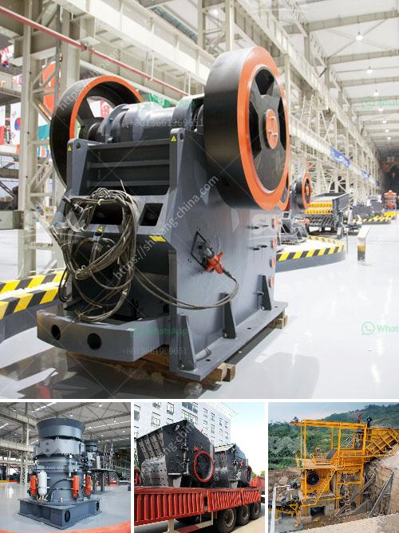

<h3>custom milling for small scale mining</h3>
Custom milling, also known as toll milling, has revolutionized the small-scale mining industry. In the past, many miners struggled to access the milling services they needed to process their ores. However, thanks to custom milling, these miners now have a viable solution that empowers them to maximize their profits and extract precious metals efficiently.

Small-scale mining operations often lack the necessary equipment and expertise to process their ores effectively. This is where custom milling comes into play. Custom milling facilities provide the necessary infrastructure and equipment to process ores on behalf of these small-scale miners. This arrangement allows miners to focus on extracting ore rather than investing in expensive milling equipment that might not be their area of expertise.

One of the significant advantages of custom milling is the ability to cater to the specific needs of the miners. Each ore deposit comes with its unique characteristics, including different mineral compositions and grades. Custom milling facilities can adapt their processes and techniques to efficiently process various types of ores. This flexibility ensures that the miner's specific requirements are met while maximizing the recovery of valuable metals.

Custom milling also offers small-scale miners access to modern and efficient milling technologies. These state-of-the-art facilities employ advanced techniques such as gravity concentration, flotation, and cyanidation to extract the maximum amount of precious metals from the ores. The advanced equipment used in custom milling facilities allows for higher recovery rates and increased profitability.

Another crucial aspect of custom milling is the environmental benefit it offers. By centralizing the milling operations, custom milling facilities are equipped to implement proper waste management systems. These facilities can effectively handle and dispose of waste material, ensuring that the environmental impact is minimized. This is particularly important in today's world, where environmental sustainability is a growing concern.

Custom milling has undoubtedly transformed the small-scale mining sector. It has provided miners with an efficient, cost-effective, and environmentally sustainable solution for processing their ores. By outsourcing the milling process, miners can now focus on what they do best – mining. As this industry continues to evolve, custom milling will undoubtedly play a vital role in supporting and facilitating small-scale mining operations.
<h3>Contact us</h3><ul><li><strong>Whatsapp:&nbsp;<a href="https://wa.me/8613661969651">+8613661969651</a></strong></li><li><a href="https://swt.shibang-china.com/?git&amp;zhl&amp;custom milling for small scale mining"><strong>Online Service(chat now)</strong></a></li></ul><h3>Related</h3><ul><li><a href='coal powder making machine.md'>coal powder making machine</a></li><li><a href='stone crushing industry.md'>stone crushing industry</a></li><li><a href='crushers for sale in.md'>crushers for sale in</a></li><li><a href='jaw crusher single toggle.md'>jaw crusher single toggle</a></li><li><a href='ball mill cement grinding.md'>ball mill cement grinding</a></li></ul>