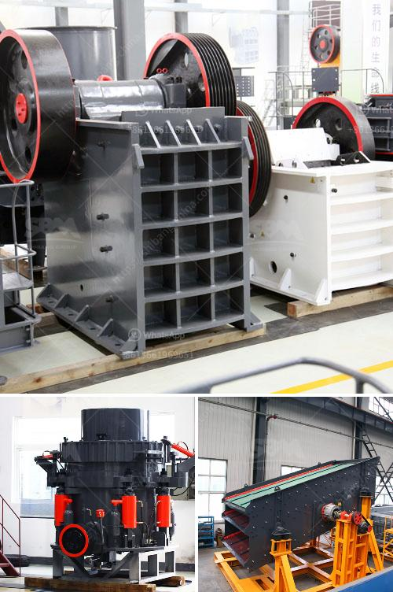

<h3>deasel stone crushers and prices in gauteng</h3>
Diesel stone crushers are commonly used in the construction and mining industries. They are machines that break down larger rocks into smaller, more manageable sizes. These crushers are powered by diesel engines, making them convenient and reliable choices for areas without access to electricity.

In Gauteng, South Africa, diesel stone crushers are popularly used due to their affordability and versatility. Gauteng is known for its bustling urban landscape and vast infrastructure developments, both of which require an abundance of construction materials. Diesel stone crushers help meet this demand by breaking down large rocks into smaller particles, making it easier to transport and use in various construction projects.

When it comes to prices, diesel stone crushers in Gauteng can vary depending on several factors. The size and capacity of the crusher, as well as the manufacturer and additional features, can influence the price. However, they generally range from around $10,000 to $60,000.

The price range mentioned includes both new and used diesel stone crushers. While new crushers come with a higher price tag due to their pristine condition, used crushers can be more affordable options for those on a limited budget. Furthermore, used crushers may still have good performance capabilities, making them a cost-effective choice.

It's important to consider other factors when purchasing a diesel stone crusher. Checking the machine's overall condition, maintenance history, and the reputation of the seller or manufacturer are crucial steps to ensure a wise investment. Additionally, comparing prices from different sources and negotiating for the best deal can further enhance cost-efficiency.

In conclusion, diesel stone crushers in Gauteng are essential for the construction and mining industries in the region. Their affordability and versatility make them a widely chosen option. Although prices can vary depending on the crusher's size, capacity, and additional features, they generally range between $10,000 and $60,000. It's important to consider other factors while purchasing, such as the machine's condition and reputation of the seller, to make the best investment decision.
<h3>Contact us</h3><ul><li><strong>Whatsapp:&nbsp;<a href="https://wa.me/8613661969651">+8613661969651</a></strong></li><li><a href="https://swt.shibang-china.com/?git&amp;zhl&amp;deasel stone crushers and prices in gauteng"><strong>Online Service(chat now)</strong></a></li></ul><h3>Related</h3><ul><li><a href='mineral grinder navi mumbai.md'>mineral grinder navi mumbai</a></li><li><a href='harga mobile crusher 100tph.md'>harga mobile crusher 100tph</a></li><li><a href='material ball mills.md'>material ball mills</a></li><li><a href='copper crusher machine.md'>copper crusher machine</a></li><li><a href='raymond mill price list.md'>raymond mill price list</a></li></ul>